# Theodore - AI-Powered Company Intelligence System

🚀 **Transform company research into AI-powered sales intelligence with an intelligent scraping pipeline.**

Theodore provides an advanced company analysis platform with dynamic link discovery, LLM-driven page selection, parallel content extraction, and AI-generated sales intelligence.

## 🎯 Current Features

- **Intelligent Company Scraper**: 4-phase processing with link discovery, LLM page selection, parallel extraction, and AI aggregation
- **Structured Research System**: 8 predefined research prompts with cost transparency and JSON/CSV export
- **Nova Pro AI Model**: 6x cost reduction ($0.66 → $0.11 per research) with enterprise-grade performance
- **Real-time Progress Tracking**: Live phase-by-phase status updates with detailed logging
- **Research Metadata Display**: Shows pages crawled, processing time, and research timestamps in UI
- **Enhanced Sales Intelligence**: AI-generated 2-3 paragraph summaries optimized for sales teams
- **Scrollable Research Modals**: Detailed company information with comprehensive research metadata
- **Modern Web Interface**: Beautiful glass morphism UI with perfect dark mode accessibility at http://localhost:5002
- **Multi-Source Discovery**: Combines Pinecone similarity search with AI-powered recommendations
- **Research Session Management**: Track multi-prompt research operations with comprehensive metrics
- **Smart Database Browser**: View companies with sales intelligence status and one-click website access
- **Universal Website Integration**: Green website buttons throughout the interface for seamless company access
- **WCAG-Compliant Design**: High-contrast dark mode with light blue (#60a5fa) links for optimal readability

## 📚 Documentation Structure

### 🎯 For New Users
- **[docs/core/DEVELOPER_ONBOARDING_NEW.md](docs/core/DEVELOPER_ONBOARDING_NEW.md)** - Start here! Complete getting started guide
- **[docs/core/setup_guide.md](docs/core/setup_guide.md)** - Installation and configuration

### 🏗️ For Developers  
- **[docs/core/CORE_ARCHITECTURE.md](docs/core/CORE_ARCHITECTURE.md)** - System architecture overview
- **[docs/technical/](docs/technical/)** - Component-specific technical documentation

### 🔍 Feature Information
- **[docs/features/](docs/features/)** - Documentation for specific features (may be experimental)

### 📦 Reference
- **[docs/legacy/](docs/legacy/)** - Historical documentation from reorganization
- **[docs/outdated/](docs/outdated/)** - Pre-reorganization documentation
- **[docs/advanced_similarity/](docs/advanced_similarity/)** - Advanced similarity algorithm research

### 📋 Documentation Status
- ✅ **Core docs**: Current and maintained
- ⚠️ **Technical docs**: May need updates, verify before use
- 🔬 **Feature docs**: Experimental/partial implementations
- 📚 **Legacy/Outdated**: Historical reference only

## 🏗️ System Architecture

### Core Components Architecture

Theodore uses a sophisticated 4-layered architecture:

1. **Web Interface Layer** - Flask + HTML/CSS/JS
2. **API Layer** - RESTful endpoints with real-time progress
3. **Core Business Logic** - 4-phase scraping + similarity discovery
4. **External Services** - AI models + vector database + web scraping

### Intelligent Scraping System (4-Phase Process)

Theodore's core innovation is its sophisticated 4-phase intelligent scraping system that combines comprehensive web crawling with AI-driven analysis. See the [Visual System Architecture](#-visual-system-architecture) section below for detailed interactive diagrams.

#### **Phase 1: Comprehensive Link Discovery**
- **Multi-source discovery**: robots.txt parsing + sitemap.xml analysis + recursive crawling
- **Discovers up to 1000 links** from all major site sections
- **Target patterns**: `/about`, `/contact`, `/careers`, `/team`, `/products`, `/services`
- **Intelligence focus**: Corporate pages, leadership info, business intelligence

#### **Phase 2: LLM-Driven Page Selection**
- **AI-powered analysis**: Uses specialized prompt to intelligently select most valuable pages
- **Prioritizes based on**: Contact data, founding info, employee count, leadership, business intelligence
- **Selects 10-50 pages** from all discovered links for maximum data extraction efficiency

#### **Phase 3: Parallel Content Extraction**
- **High-performance processing**: 10 concurrent pages simultaneously
- **Content optimization**: Removes nav, footer, scripts while preserving main content
- **Chromium-based**: Uses Crawl4AI with JavaScript execution for modern websites
- **Structured extraction**: Targets main content areas with intelligent selectors

#### **Phase 4: LLM Content Aggregation**
- **Large context analysis**: Gemini 2.5 Pro with 1M token context window
- **Comprehensive processing**: Combines content from all scraped pages
- **Business intelligence generation**: Creates structured summaries focused on sales insights
- **Quality output**: 2-3 paragraph summaries optimized for business context

## 📊 Visual System Architecture

### Complete System Overview

```mermaid
%%{init: {
  'theme': 'dark',
  'themeVariables': {
    'primaryColor': '#ff6b6b',
    'primaryTextColor': '#ffffff',
    'primaryBorderColor': '#ff4757',
    'lineColor': '#ffa502',
    'secondaryColor': '#2ed573',
    'tertiaryColor': '#5352ed',
    'background': '#2f3542',
    'mainBkg': '#2f3542',
    'secondBkg': '#57606f',
    'tertiaryBkg': '#3742fa'
  }
}}%%

graph TB
    %% User Interface Layer
    subgraph UI["🎨 USER INTERFACE LAYER"]
        DiscoveryTab["🔍 Discovery Tab<br/>Find Similar Companies"]
        ProcessTab["⚙️ Process Tab<br/>Add New Company"]
        DatabaseTab["🗃️ Database Tab<br/>Browse All Companies"]
        SettingsTab["⚙️ Settings Tab<br/>Configuration"]
    end
    
    %% API Layer
    subgraph API["🔗 FLASK API ENDPOINTS"]
        DiscoverAPI["/api/discover<br/>POST"]
        ProcessAPI["/api/process-company<br/>POST"]
        DatabaseAPI["/api/database<br/>GET"]
        SettingsAPI["/api/settings<br/>GET/POST"]
    end
    
    %% Core Processing
    subgraph CORE["🧠 CORE PROCESSING ENGINE"]
        SimpleDiscovery["SimpleEnhancedDiscovery<br/>🔍 AI + Vector Search"]
        IntelligentScraper["IntelligentCompanyScraper<br/>🕷️ 4-Phase Pipeline"]
        MainPipeline["TheodoreIntelligencePipeline<br/>🔧 Orchestration"]
    end
    
    %% AI Services
    subgraph AI["🤖 AI MODEL SERVICES"]
        Gemini["Gemini 2.5 Pro<br/>📝 Content Aggregation<br/>1M Token Context"]
        Bedrock["AWS Bedrock<br/>🧮 Nova Pro Model<br/>6x Cost Reduction"]
        OpenAI["OpenAI GPT-4o-mini<br/>🔄 Fallback Service"]
    end
    
    %% Storage
    subgraph STORAGE["🗃️ VECTOR DATABASE"]
        Pinecone["Pinecone<br/>📊 Vector Storage<br/>1536 Dimensions"]
        Metadata["Essential Metadata<br/>📋 5 Core Fields<br/>72% Reduction"]
    end
    
    %% Data Flow Connections
    DiscoveryTab --> DiscoverAPI
    ProcessTab --> ProcessAPI
    DatabaseTab --> DatabaseAPI
    SettingsTab --> SettingsAPI
    
    DiscoverAPI --> SimpleDiscovery
    ProcessAPI --> MainPipeline
    DatabaseAPI --> Pinecone
    
    SimpleDiscovery --> Pinecone
    SimpleDiscovery --> Bedrock
    
    MainPipeline --> IntelligentScraper
    IntelligentScraper --> Gemini
    MainPipeline --> Bedrock
    
    Bedrock --> Pinecone
    Gemini --> Pinecone
    Pinecone --> Metadata
    
    %% Styling
    classDef uiStyle fill:#ff6b6b,stroke:#ff4757,stroke-width:3px,color:#ffffff
    classDef apiStyle fill:#ffa502,stroke:#ff6348,stroke-width:3px,color:#ffffff
    classDef coreStyle fill:#2ed573,stroke:#20bf6b,stroke-width:3px,color:#ffffff
    classDef aiStyle fill:#5352ed,stroke:#3742fa,stroke-width:3px,color:#ffffff
    classDef storageStyle fill:#8e44ad,stroke:#9b59b6,stroke-width:3px,color:#ffffff
    
    class DiscoveryTab,ProcessTab,DatabaseTab,SettingsTab uiStyle
    class DiscoverAPI,ProcessAPI,DatabaseAPI,SettingsAPI apiStyle
    class SimpleDiscovery,IntelligentScraper,MainPipeline coreStyle
    class Gemini,Bedrock,OpenAI aiStyle
    class Pinecone,Metadata storageStyle
```



### 4-Phase Intelligent Scraping Pipeline

```mermaid
%%{init: {
  'theme': 'dark',
  'themeVariables': {
    'primaryColor': '#ff6b6b',
    'primaryTextColor': '#ffffff',
    'primaryBorderColor': '#ff4757',
    'lineColor': '#ffa502',
    'secondaryColor': '#2ed573',
    'tertiaryColor': '#5352ed',
    'background': '#2f3542',
    'mainBkg': '#2f3542',
    'secondBkg': '#57606f'
  }
}}%%

flowchart TD
    Start["🚀 Company Input<br/>Name + Website URL"] --> Phase1
    
    subgraph Phase1["🔍 PHASE 1: LINK DISCOVERY"]
        RobotsTxt["🤖 robots.txt<br/>Parse additional paths<br/>Find sitemaps"]
        Sitemap["🗺️ sitemap.xml<br/>Structured navigation<br/>All site sections"]
        Recursive["🔄 Recursive Crawling<br/>3 levels deep<br/>Navigation links"]
        
        RobotsTxt --> Combine1["📝 Combine Links<br/>Up to 1000 URLs"]
        Sitemap --> Combine1
        Recursive --> Combine1
    end
    
    Phase1 --> Phase2
    
    subgraph Phase2["🎯 PHASE 2: LLM PAGE SELECTION"]
        LLMAnalysis["🧠 Gemini 2.5 Flash<br/>Analyze all discovered links<br/>Intelligent prioritization"]
        Selection["✅ Select 10-50 Pages<br/>• /contact, /about<br/>• /team, /careers<br/>• /products, /services<br/>• Business intelligence"]
        
        LLMAnalysis --> Selection
    end
    
    Phase2 --> Phase3
    
    subgraph Phase3["📄 PHASE 3: PARALLEL EXTRACTION"]
        Crawl4AI["🕷️ Crawl4AI AsyncWebCrawler<br/>Chromium browser<br/>JavaScript execution"]
        Parallel["⚡ 10 Concurrent Requests<br/>Real-time progress<br/>Content optimization"]
        Clean["🧹 Clean Content<br/>Remove nav/footer<br/>Preserve main content"]
        
        Crawl4AI --> Parallel
        Parallel --> Clean
    end
    
    Phase3 --> Phase4
    
    subgraph Phase4["🧠 PHASE 4: AI AGGREGATION"]
        Aggregate["🔮 Gemini 2.5 Pro<br/>1M token context<br/>Process all page content"]
        Intelligence["📊 Sales Intelligence<br/>2-3 paragraph summary<br/>Business context<br/>Market positioning"]
        
        Aggregate --> Intelligence
    end
    
    Phase4 --> Storage
    
    subgraph Storage["🗃️ STORAGE & ANALYSIS"]
        Analysis["🤖 Bedrock Analysis<br/>Industry classification<br/>Business model<br/>Company stage"]
        Embedding["📐 Vector Embedding<br/>Amazon Titan<br/>1536 dimensions"]
        Database["🗄️ Pinecone Storage<br/>Vector + metadata<br/>Semantic search ready"]
        
        Analysis --> Embedding
        Embedding --> Database
    end
    
    %% Progress tracking
    Phase1 -.-> Progress["📊 Real-time Progress<br/>Live UI updates<br/>Phase-by-phase status"]
    Phase2 -.-> Progress
    Phase3 -.-> Progress
    Phase4 -.-> Progress
    
    %% Styling
    classDef phaseStyle fill:#ff6b6b,stroke:#ff4757,stroke-width:3px,color:#ffffff
    classDef processStyle fill:#2ed573,stroke:#20bf6b,stroke-width:2px,color:#ffffff
    classDef aiStyle fill:#5352ed,stroke:#3742fa,stroke-width:2px,color:#ffffff
    classDef storageStyle fill:#8e44ad,stroke:#9b59b6,stroke-width:2px,color:#ffffff
    classDef progressStyle fill:#ffa502,stroke:#ff6348,stroke-width:2px,color:#ffffff
    
    class Start phaseStyle
    class RobotsTxt,Sitemap,Recursive,Combine1,LLMAnalysis,Selection,Crawl4AI,Parallel,Clean processStyle
    class Aggregate,Intelligence,Analysis aiStyle
    class Embedding,Database storageStyle
    class Progress progressStyle
```



### Company Discovery Workflow

```mermaid
%%{init: {
  'theme': 'dark',
  'themeVariables': {
    'primaryColor': '#ff6b6b',
    'primaryTextColor': '#ffffff',
    'primaryBorderColor': '#ff4757',
    'lineColor': '#ffa502',
    'secondaryColor': '#2ed573',
    'tertiaryColor': '#5352ed',
    'background': '#2f3542',
    'mainBkg': '#2f3542',
    'secondBkg': '#57606f'
  }
}}%%

flowchart TD
    UserInput["👤 User Input<br/>Company Name"] --> Discovery
    
    subgraph Discovery["🔍 DISCOVERY ENGINE"]
        DatabaseCheck["🗃️ Database Check<br/>Pinecone.find_by_name()"]
        
        DatabaseCheck -->|Found| ExistingFlow["📊 Existing Company Flow"]
        DatabaseCheck -->|Not Found| UnknownFlow["❓ Unknown Company Flow"]
    end
    
    subgraph ExistingFlow["📊 EXISTING COMPANY ANALYSIS"]
        ContextualLLM["🧠 LLM Contextual Discovery<br/>Use company description<br/>Generate search terms<br/>Industry analysis"]
        VectorSearch["📐 Vector Similarity Search<br/>Embedding comparison<br/>Cosine similarity<br/>Industry filtering"]
        
        ContextualLLM --> Combine
        VectorSearch --> Combine
    end
    
    subgraph UnknownFlow["❓ UNKNOWN COMPANY ANALYSIS"]
        InferLLM["🔮 LLM Inference<br/>Predict industry<br/>Infer business model<br/>Generate search strategy"]
        SemanticSearch["🔍 Semantic Discovery<br/>Industry-based matching<br/>Business model similarity<br/>Market positioning"]
        
        InferLLM --> SemanticSearch
        SemanticSearch --> Combine
    end
    
    subgraph Enhancement["✨ RESULT ENHANCEMENT"]
        Combine["🔗 Combine & Deduplicate<br/>Merge LLM + Vector results<br/>Remove duplicates<br/>Rank by relevance"]
        Research["📋 Research Status Check<br/>Database metadata<br/>Processing history<br/>Availability assessment"]
        Format["📊 Format Results<br/>Confidence scores<br/>Reasoning explanations<br/>Business context"]
        
        Combine --> Research
        Research --> Format
    end
    
    Format --> Response["📤 JSON Response<br/>Similarity scores<br/>Discovery methods<br/>Research status<br/>Business relationships"]
    
    Response --> UI["🎨 UI Display<br/>Discovery cards<br/>Website links<br/>Research buttons<br/>Real-time updates"]
    
    %% Styling
    classDef inputStyle fill:#ff6b6b,stroke:#ff4757,stroke-width:3px,color:#ffffff
    classDef discoveryStyle fill:#ffa502,stroke:#ff6348,stroke-width:2px,color:#ffffff
    classDef existingStyle fill:#2ed573,stroke:#20bf6b,stroke-width:2px,color:#ffffff
    classDef unknownStyle fill:#5352ed,stroke:#3742fa,stroke-width:2px,color:#ffffff
    classDef enhanceStyle fill:#8e44ad,stroke:#9b59b6,stroke-width:2px,color:#ffffff
    classDef outputStyle fill:#e67e22,stroke:#d35400,stroke-width:2px,color:#ffffff
    
    class UserInput inputStyle
    class DatabaseCheck discoveryStyle
    class ContextualLLM,VectorSearch existingStyle
    class InferLLM,SemanticSearch unknownStyle
    class Combine,Research,Format enhanceStyle
    class Response,UI outputStyle
```



### Google Sheets Batch Processing Workflow

**🔄 Processing Model: Sequential Companies, Parallel Pages**
- Companies are processed **one at a time** (sequential)
- Within each company, pages are scraped **10 at a time** (parallel)
- 2-second delay between companies for rate limiting and respectful crawling

```mermaid
%%{init: {
  'theme': 'dark',
  'themeVariables': {
    'primaryColor': '#ff6b6b',
    'primaryTextColor': '#ffffff',
    'primaryBorderColor': '#ff4757',
    'lineColor': '#ffa502',
    'secondaryColor': '#2ed573',
    'tertiaryColor': '#5352ed',
    'background': '#2f3542',
    'mainBkg': '#2f3542',
    'secondBkg': '#57606f',
    'tertiaryBkg': '#3742fa'
  }
}}%%

flowchart TD
    Start["🚀 Batch Processing Start<br/>CLI Command or API"] --> Initialize
    
    subgraph Initialize["⚙️ INITIALIZATION PHASE"]
        ServiceAuth["🔐 Service Account Auth<br/>theodore-service-account.json<br/>No browser required"]
        SheetsClient["📊 Google Sheets Client<br/>Validate spreadsheet access<br/>Setup dual-sheet structure"]
        Pipeline["🔧 Theodore Pipeline<br/>Initialize AI models<br/>Pinecone connection"]
        
        ServiceAuth --> SheetsClient
        SheetsClient --> Pipeline
    end
    
    Initialize --> ReadSheet
    
    subgraph ReadSheet["📋 SHEET READING PHASE"]
        ReadCompanies["📖 Read Companies Sheet<br/>Extract company names<br/>Website URLs<br/>Row numbers"]
        FilterStatus["🔍 Filter by Status<br/>Skip 'completed' companies<br/>Process 'pending' only<br/>Resume 'failed' companies"]
        BatchLimit["📊 Apply Batch Limits<br/>Limit: 10 companies<br/>Rate limiting: 2s delay<br/>Cost estimation"]
        
        ReadCompanies --> FilterStatus
        FilterStatus --> BatchLimit
    end
    
    ReadSheet --> ProcessLoop
    
    subgraph ProcessLoop["🔄 SEQUENTIAL COMPANY PROCESSING"]
        UpdateStatus1["📝 Update Status: 'processing'<br/>Real-time sheet update<br/>Progress tracking<br/>Timestamp logging"]
        ProcessSingle["🕷️ Single Company Processing<br/>⚠️ ONE COMPANY AT A TIME<br/>Full 4-phase pipeline<br/>25-60 second processing"]
        
        subgraph InternalParallel["⚡ INTERNAL PARALLEL PROCESSING"]
            Phase1["🔍 Phase 1: Link Discovery<br/>Sequential discovery"]
            Phase2["🎯 Phase 2: Page Selection<br/>LLM analysis"]
            Phase3["📄 Phase 3: Content Extraction<br/>🔀 10 CONCURRENT PAGES<br/>Parallel web scraping"]
            Phase4["🧠 Phase 4: AI Aggregation<br/>1M token context"]
            
            Phase1 --> Phase2
            Phase2 --> Phase3
            Phase3 --> Phase4
        end
        
        CheckResult["❓ Check Processing Result<br/>Validate scrape_status<br/>Verify extracted data<br/>Quality assessment"]
        
        UpdateStatus1 --> ProcessSingle
        ProcessSingle --> InternalParallel
        InternalParallel --> CheckResult
    end
    
    ProcessLoop --> ResultHandling
    
    subgraph ResultHandling["📊 RESULT HANDLING"]
        SuccessPath["✅ SUCCESS PATH"]
        FailurePath["❌ FAILURE PATH"]
        
        CheckResult -->|Success| SuccessPath
        CheckResult -->|Failed| FailurePath
        
        subgraph SuccessPath["✅ SUCCESS OPERATIONS"]
            UpdateSuccess["📝 Update Status: 'completed'<br/>Companies sheet status<br/>Success timestamp"]
            WriteDetails["📋 Write Complete Data<br/>Details sheet update<br/>All extracted fields<br/>Metadata preservation"]
            
            UpdateSuccess --> WriteDetails
        end
        
        subgraph FailurePath["❌ FAILURE OPERATIONS"]
            UpdateFailed["📝 Update Status: 'failed'<br/>Error logging<br/>Failure timestamp<br/>Error details"]
            LogError["🚨 Error Logging<br/>Exception capture<br/>Debugging info<br/>Retry planning"]
            
            UpdateFailed --> LogError
        end
    end
    
    ResultHandling --> NextCompany
    
    subgraph NextCompany["➡️ SEQUENTIAL ITERATION CONTROL"]
        RateLimit["⏱️ Sequential Rate Limiting<br/>⏸️ 2-second delay between companies<br/>🚫 NO PARALLEL COMPANY PROCESSING<br/>API quota management<br/>Respectful web scraping"]
        ProgressUpdate["📊 Progress Reporting<br/>Console logs: Company X/Y<br/>Success/failure counts<br/>Time estimates per company"]
        CheckMore["❓ More Companies in Queue?<br/>Sequential batch completion<br/>One-by-one processing"]
        
        RateLimit --> ProgressUpdate
        ProgressUpdate --> CheckMore
        CheckMore -->|Yes| ProcessLoop
        CheckMore -->|No| Summary
    end
    
    subgraph Summary["📈 BATCH COMPLETION"]
        FinalStats["📊 Final Statistics<br/>Total processing time<br/>Success/failure rates<br/>Average time per company"]
        SheetLink["🌐 Sheet Access Link<br/>Direct Google Sheets URL<br/>Results verification<br/>Manual review"]
        
        FinalStats --> SheetLink
    end
    
    Summary --> Complete["🎉 Batch Processing Complete<br/>Results available in<br/>Google Sheets"]
    
    %% Error Handling
    ProcessCompany -.->|Timeout/Error| ErrorRecovery["🔧 Error Recovery<br/>Exception handling<br/>Graceful degradation<br/>Continue with next"]
    ErrorRecovery --> FailurePath
    
    %% Real-time Updates
    ProcessLoop -.-> LiveProgress["📡 Live Progress Updates<br/>Real-time sheet updates<br/>Console feedback<br/>Status monitoring"]
    
    %% Sheet Structure
    subgraph SheetStructure["📊 DUAL SHEET STRUCTURE"]
        CompaniesSheet["📋 Companies Sheet<br/>• Company Name<br/>• Website URL<br/>• Processing Status<br/>• Timestamps"]
        DetailsSheet["📄 Details Sheet<br/>• Complete extracted data<br/>• All research fields<br/>• Metadata & metrics<br/>• Processing details"]
        
        CompaniesSheet -.-> DetailsSheet
    end
    
    WriteDetails -.-> SheetStructure
    
    %% Styling
    classDef startStyle fill:#ff6b6b,stroke:#ff4757,stroke-width:3px,color:#ffffff
    classDef initStyle fill:#ffa502,stroke:#ff6348,stroke-width:2px,color:#ffffff
    classDef processStyle fill:#2ed573,stroke:#20bf6b,stroke-width:2px,color:#ffffff
    classDef parallelStyle fill:#3498db,stroke:#2980b9,stroke-width:3px,color:#ffffff
    classDef successStyle fill:#27ae60,stroke:#2ecc71,stroke-width:2px,color:#ffffff
    classDef failureStyle fill:#e74c3c,stroke:#c0392b,stroke-width:2px,color:#ffffff
    classDef controlStyle fill:#5352ed,stroke:#3742fa,stroke-width:2px,color:#ffffff
    classDef summaryStyle fill:#8e44ad,stroke:#9b59b6,stroke-width:2px,color:#ffffff
    classDef structureStyle fill:#34495e,stroke:#2c3e50,stroke-width:2px,color:#ffffff
    
    class Start startStyle
    class ServiceAuth,SheetsClient,Pipeline initStyle
    class ReadCompanies,FilterStatus,BatchLimit,UpdateStatus1,ProcessSingle processStyle
    class Phase1,Phase2,Phase3,Phase4 parallelStyle
    class UpdateSuccess,WriteDetails successStyle
    class UpdateFailed,LogError,ErrorRecovery failureStyle
    class RateLimit,ProgressUpdate,CheckMore,CheckResult controlStyle
    class FinalStats,SheetLink,Complete summaryStyle
    class CompaniesSheet,DetailsSheet structureStyle
```



## 📊 Current Status

### ✅ Production Ready Features
- **Intelligent Company Processing**: Complete 4-phase scraper with real-time progress tracking
- **Enhanced Sales Intelligence**: AI-generated summaries replacing hardcoded schemas
- **Modern Web Interface**: Beautiful UI with live progress visualization
- **Database Browser**: View and manage companies with sales intelligence status
- **Multi-Model Integration**: Gemini 2.5 Pro + AWS Bedrock Nova Pro + OpenAI working together
- **Vector Storage**: Optimized Pinecone integration with sales intelligence metadata

### ✅ Latest Major Update (December 2025)
- **Structured Research System**: ✅ 8 predefined research prompts covering job listings, decision makers, funding, tech stack, and more
- **Nova Pro Model Integration**: ✅ 6x cost reduction with `amazon.nova-pro-v1:0` for enhanced research operations
- **Research Session Management**: ✅ Track multi-prompt research with cost transparency and export capabilities
- **Enhanced API Endpoints**: ✅ Complete REST API for structured research operations and session management
- **Cost Optimization**: ✅ Real-time cost estimation and tracking for all research operations
- **Export Functionality**: ✅ JSON and CSV export for comprehensive research analysis

### 🎯 Technical Achievements
- **Dynamic Link Discovery**: Automatically discovers 670+ links per company (robots.txt, sitemaps, recursive)
- **LLM Page Selection**: AI chooses most promising 5-10 pages for sales intelligence
- **Parallel Processing**: 10 concurrent Crawl4AI extractions for speed
- **Large Context Processing**: Gemini 2.5 Pro handles 1M+ tokens for content aggregation
- **Production Architecture**: Async processing, error handling, progress tracking, and user feedback

## 🚀 Quick Start

### Prerequisites

- Python 3.9+
- OpenAI API key
- AWS Bedrock access (optional)
- Pinecone account

### Installation

```bash
# Clone the repository
git clone https://github.com/yourusername/theodore.git
cd theodore

# Set up virtual environment
python -m venv venv
source venv/bin/activate  # or `venv\Scripts\activate` on Windows

# Install dependencies
pip install -r requirements.txt

# Configure environment
cp .env.example .env
# Edit .env with your API keys
```

## 🛠️ Development Commands

### Running the Application

**✅ CORRECT STARTUP METHOD:**
```bash
# Start main web application (PROPER WAY - background with logging)
nohup python3 app.py > app.log 2>&1 & echo $!
# Verify startup: sleep 10 && tail -10 app.log
# Access at: http://localhost:5002
# Settings page: http://localhost:5002/settings

# Alternative: Development mode (foreground)
python3 app.py

# Stop the application
pkill -f "python3 app.py"
```

**🔧 Troubleshooting Startup:**
```bash
# Check if app is running
curl -I http://localhost:5002/

# View startup logs
tail -f app.log

# Check port usage
lsof -i :5002

# Verify imports
python3 -c "import app; print('Import successful')"
```

### Testing & Debugging
```bash
# Test single company processing
python test_real_company.py

# Test scraping pipeline
python test_subprocess_scraper.py

# Test research system
python tests/test_real_ai.py

# Debug environment setup
python test_credentials.py

# Test similarity engine
python tests/test_similarity_engine.py

# Additional test files in tests/ directory
```

### Database Operations
```bash
# Check Pinecone database
python scripts/check_pinecone_database.py

# Clear all data
python scripts/clear_pinecone.py

# Add test companies
python scripts/add_test_companies_with_similarity.py

# Extract raw data
python scripts/extract_raw_pinecone_data.py
```

### 📊 Complete Research Data Display

Theodore now displays all extracted company intelligence in organized sections:

**Basic Information**:
- Industry, Business Model, Location, Company Size

**Business Details**:
- Target Market, Key Services, Value Proposition, Pain Points

**Technology Information**:
- Tech Stack (development tools, frameworks, platforms)

**Research Metadata**:
- Pages crawled count, Crawl depth, Processing time, Research timestamp

**In Research Details Modal**:
- Complete data across all 13+ fields when available
- Scrollable interface for comprehensive company profiles
- Organized sections for easy information discovery

**For Developers**:
```javascript
// Console logs show detailed research metadata
📋 Pages Crawled: [page1, page2, page3, ...]
📋 Processing Time: 2.5
📋 Research Timestamp: 2024-12-08T18:25:30.123Z
```

**Programmatic Usage**:
```python
from src.main_pipeline import TheodoreIntelligencePipeline
from src.models import CompanyIntelligenceConfig

# Initialize Theodore
config = CompanyIntelligenceConfig()
pipeline = TheodoreIntelligencePipeline(config, 
    pinecone_api_key="your-key",
    pinecone_environment="your-env", 
    pinecone_index="theodore-companies")

# Process single company
result = pipeline.process_single_company("Company Name", "https://company.com")
```

## ✨ Key Features

### 📋 Structured Research System

- **8 Predefined Research Prompts**: Job listings, decision makers, products/services, funding, tech stack, news, competitive landscape, customer analysis
- **Cost Transparency**: Real-time cost estimation with Nova Pro pricing ($0.011 per 1K tokens)
- **Research Sessions**: Track multi-prompt research operations with comprehensive metrics
- **Export Capabilities**: JSON and CSV export for analysis and reporting
- **Session Management**: Historical research tracking with success rates and cost analysis

### 🧠 Intelligent Company Scraper

- **Dynamic Link Discovery**: Crawls robots.txt, sitemaps.xml, and recursive page discovery
- **LLM Page Selection**: AI analyzes and selects most promising pages for sales intelligence
- **Parallel Content Extraction**: 10 concurrent Crawl4AI processes for maximum speed
- **AI Content Aggregation**: Gemini 2.5 Pro processes up to 1M tokens for comprehensive summaries

### 🎯 Sales Intelligence Generation

- **AI-Generated Summaries**: 2-3 focused paragraphs optimized for sales teams
- **Dynamic Content**: No hardcoded schemas - LLM decides what's important
- **Business Context**: Includes market positioning, value propositions, and competitive advantages
- **Real-time Progress**: Live 4-phase tracking with detailed logging and status updates

### 📊 Vector Storage & Search

- **Optimized Metadata**: 5 essential fields vs 62+ original (72% cost reduction)
- **Semantic Search**: Find companies by business model, industry, target market
- **Company Clustering**: Automatic sector and similarity grouping
- **Hybrid Storage**: Essential metadata in Pinecone, full data separately

## 📈 Performance Metrics

- **Link Discovery**: 670+ links discovered per company (robots.txt + sitemaps + recursive)
- **Content Quality**: 2-3 paragraph AI summaries vs previous hardcoded 15+ fields
- **Processing Speed**: Parallel extraction with 10 concurrent requests
- **Large Context**: Gemini 2.5 Pro handles 1M+ token aggregation
- **Success Rate**: End-to-end processing with comprehensive error handling

## 🛠️ Technical Stack

- **Intelligent Scraping**: Custom 4-phase pipeline with Crawl4AI integration
- **AI Models**: Gemini 2.5 Pro (1M context), AWS Bedrock Nova Pro, OpenAI GPT-4o-mini
- **Vector Database**: Pinecone serverless with sales intelligence metadata
- **Progress Tracking**: Real-time JSON-based logging with thread-safe updates
- **Web Interface**: Flask + modern CSS/JS with gradient design and live updates

## 📁 Project Structure

### Production Files (Core System)
```
Theodore/
├── app.py                                  # 🌐 Main Flask application
├── templates/
│   ├── index.html                         # 🎨 Primary UI (4 tabs)
│   └── settings.html                      # ⚙️ Configuration UI
├── static/
│   ├── css/style.css                      # 💄 Styling
│   └── js/app.js                          # 🧠 Frontend logic
└── src/
    ├── main_pipeline.py                   # 🔧 Core orchestration
    ├── models.py                          # 📋 Pydantic data models
    ├── intelligent_company_scraper.py     # 🕷️ 4-phase scraper
    ├── simple_enhanced_discovery.py       # 🔍 Similarity engine
    ├── bedrock_client.py                  # 🤖 AWS AI client
    ├── pinecone_client.py                 # 🗃️ Vector database
    ├── gemini_client.py                   # 🧮 Google AI client
    ├── openai_client.py                   # 🔄 OpenAI fallback
    └── progress_logger.py                 # 📊 Real-time progress
```

### Organized Resources (Clean Structure)
```
├── docs/                                  # 📚 Organized documentation
│   ├── core/                             # Essential docs
│   ├── technical/                        # Component-specific
│   ├── features/                         # Feature docs
│   ├── outdated/                         # Pre-reorganization
│   └── legacy/                           # Historical reference
├── src/
│   ├── experimental/                     # 🔬 Experimental features
│   ├── legacy/                          # 📚 Legacy implementations  
│   └── sheets_integration/              # 📊 Google Sheets feature
├── tests/                               # 🧪 Organized test suite
│   ├── legacy/                          # Legacy tests
│   └── sandbox/                         # Development testing
├── scripts/                             # 🛠️ Utility scripts
│   ├── analysis/                        # Data analysis tools
│   ├── batch/                           # Batch processing
│   ├── testing/                         # Test utilities
│   └── utilities/                       # General utilities
├── config/                              # ⚙️ Configuration management
└── data/                                # 📊 Input data and exports
```

## 🔧 Configuration

### Environment Variables (Required)
```bash
# AWS Bedrock (Primary AI)
AWS_ACCESS_KEY_ID=...
AWS_SECRET_ACCESS_KEY=...
BEDROCK_ANALYSIS_MODEL=amazon.nova-pro-v1:0  # 6x cost reduction

# Google AI (Primary Analysis)
GEMINI_API_KEY=AIza...

# Vector Database
PINECONE_API_KEY=...
PINECONE_INDEX_NAME=theodore-companies

# Optional: OpenAI (Fallback)
OPENAI_API_KEY=sk-...
```

### AI Model Hierarchy
1. **Primary:** Gemini 2.5 Pro (1M context for aggregation)
2. **Cost-Optimized:** Nova Pro (6x cheaper for research)
3. **Fallback:** OpenAI GPT-4o-mini (when others fail)

## 💡 Development Notes

### Key Data Flow Patterns

**Company Research Workflow:**
```
User Input → Research Manager → Intelligent Scraper → AI Analysis → Vector Generation → Pinecone Storage → Similarity Analysis → UI Display
```

**Discovery Workflow:**
```
Company Name → Database Check → Research Status Assessment → Real-time Research (if needed) → Enhanced Results Display
```

### Threading & Concurrency
- Research manager uses thread-safe progress logging
- Scraper implements semaphore-limited parallel extraction
- UI updates via Server-Sent Events (SSE)

### Error Handling Strategy
- Graceful degradation: AI analysis → web search → manual fallback
- Comprehensive logging with emoji prefixes for easy debugging
- User-friendly error messages with actionable suggestions

## 🎯 Use Cases

### Business Intelligence
- **Survey Analysis**: Process hundreds of company responses automatically
- **Market Research**: Discover companies by sector, business model, or technology
- **Competitive Analysis**: Find similar companies and analyze market positioning

### Sales & Marketing
- **Lead Qualification**: Automatically research prospect companies
- **Market Segmentation**: Cluster companies by characteristics
- **Opportunity Identification**: Find companies matching ideal customer profiles

### Investment & M&A
- **Deal Sourcing**: Identify potential acquisition targets
- **Market Mapping**: Understand competitive landscapes
- **Due Diligence**: Automated company intelligence gathering

## 🔗 API Endpoints

### Structured Research APIs
```bash
# Get available research prompts
GET /api/research/prompts/available

# Estimate research cost
POST /api/research/prompts/estimate
{
  "selected_prompts": ["job_listings", "decision_makers", "funding_stage"]
}

# Start structured research
POST /api/research/structured/start
{
  "company_name": "OpenAI",
  "website": "https://openai.com",
  "selected_prompts": ["job_listings", "decision_makers"],
  "include_base_research": true
}

# Get research session results
GET /api/research/structured/session/{session_id}

# Export research results
GET /api/research/structured/export/{session_id}?format=csv
```

### Company Discovery APIs
```bash
# Discover similar companies
POST /api/discover
{
  "company_name": "Stripe",
  "max_results": 10
}

# Browse database
GET /api/database/browse?page=1&limit=20

# Get company details
GET /api/company/{company_id}
```

## 💡 Example Queries

```python
# Find AI/ML companies in healthcare
healthcare_ai = pipeline.semantic_search(
    "AI machine learning healthcare medical", 
    filters={"industry": "Healthcare", "business_model": "B2B"}
)

# Discover SaaS startups
saas_startups = pipeline.semantic_search(
    "SaaS software subscription startup",
    filters={"business_model": "SaaS", "company_size": "startup"}
)

# Structured research with cost estimation
from src.research_prompts import research_prompt_library
cost_estimate = research_prompt_library.estimate_total_cost(
    ["job_listings", "decision_makers", "tech_stack"]
)
print(f"Estimated cost: ${cost_estimate['total_cost']:.4f}")
```

## 🔧 Configuration

Theodore supports extensive configuration for different environments:

```python
# Development
config = CompanyIntelligenceConfig(
    max_companies=5,
    enable_caching=True,
    rate_limit_delay=2.0
)

# Production
config = CompanyIntelligenceConfig(
    max_companies=100,
    enable_clustering=True,
    batch_processing=True,
    rate_limit_delay=1.0
)
```

## 🤝 Contributing

1. Fork the repository
2. Create a feature branch (`git checkout -b feature/amazing-feature`)
3. Commit your changes (`git commit -m 'Add amazing feature'`)
4. Push to the branch (`git push origin feature/amazing-feature`)
5. Open a Pull Request

## 📄 License

This project is licensed under the MIT License - see the [LICENSE](LICENSE) file for details.

## 🙏 Acknowledgments

- **Crawl4AI**: For providing excellent AI-powered web scraping capabilities
- **OpenAI**: For GPT models that enable intelligent extraction
- **Pinecone**: For scalable vector database infrastructure
- **AWS Bedrock**: For enterprise-grade AI model access

---

**Built for the AI era of business intelligence.** 🚀

*Theodore transforms manual company research into intelligent, automated insights.*