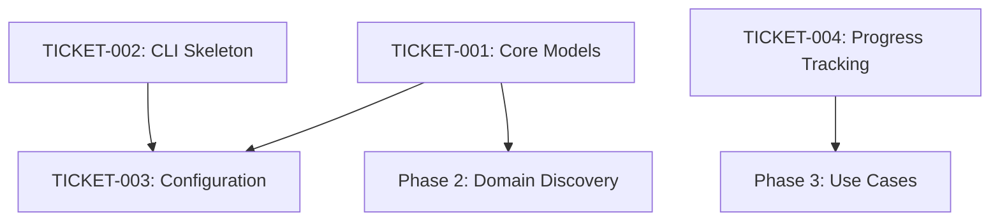

# Theodore v2 - Comprehensive Implementation Roadmap

## Executive Summary

This comprehensive roadmap analyzes all 27 tickets for Theodore v2 and provides a strategic implementation plan with dependency analysis, phased approach, timeline estimates, critical path identification, and risk assessment. The implementation is structured around clean architecture principles with MCP-first search integration.

---

## Phase Overview & Timeline

**Total Estimated Time: 14-16 weeks**

### Phase 1: Core Foundation (3-4 weeks)
**Critical Path Items - Must be completed first**

### Phase 2: Infrastructure Adapters (4-5 weeks) 
**Can be developed in parallel after Phase 1**

### Phase 3: Business Logic & Use Cases (2-3 weeks)
**Requires completion of Phases 1 & 2**

### Phase 4: User Interfaces (3-4 weeks)
**Can begin partially after Phase 3, full implementation requires completed system**

### Phase 5: Advanced Features & QA (2-3 weeks)
**Final integration, testing, and enterprise features**

---

## Phase 1: Core Foundation (3-4 weeks)

### **Critical Path - Must Complete First**

| Ticket | Title | Time | Priority | Dependencies |
|--------|-------|------|----------|--------------|
| **TICKET-001** | Core Domain Models | 4-6h | CRITICAL | None |
| **TICKET-002** | CLI Application Skeleton | 2-3h | HIGH | None |
| **TICKET-003** | Configuration System | 3-4h | CRITICAL | TICKET-002 |
| **TICKET-004** | Progress Tracking Port | 3-4h | HIGH | None |

### **Key Deliverables**
- ✅ Complete domain model foundation with Company, Research, Similarity entities
- ✅ CLI skeleton with Click framework and command structure
- ✅ Production-grade configuration system with environment support
- ✅ Progress tracking interface for real-time updates

### **Phase 1 Dependencies**


### **Risks & Mitigation**
- **Risk**: Domain model design changes cascade through entire system
- **Mitigation**: Thorough design review and stakeholder validation before implementation
- **Risk**: Configuration system complexity delays other components
- **Mitigation**: Start with simple configuration, iterate to add advanced features

---

## Phase 2: Infrastructure Adapters (4-5 weeks)

### **Port Definitions (Week 1)**
*These can be developed in parallel*

| Ticket | Title | Time | Dependencies | Team Assignment |
|--------|-------|------|--------------|-----------------|
| **TICKET-006** | Domain Discovery Port | 2-3h | TICKET-001 | Backend Team A |
| **TICKET-007** | Web Scraper Port | 2-3h | TICKET-001 | Backend Team A |
| **TICKET-008** | AI Provider Port | 2-3h | TICKET-001 | Backend Team B |
| **TICKET-009** | Vector Storage Port | 2-3h | TICKET-001 | Backend Team B |

### **Core Infrastructure Adapters (Weeks 2-3)**
*Parallel development possible*

| Ticket | Title | Time | Critical Path | Priority |
|--------|-------|------|---------------|----------|
| **TICKET-012** | Google Search Adapter | 3-4h | No | MEDIUM |
| **TICKET-013** | Crawl4AI Adapter | 6-8h | **YES** | CRITICAL |
| **TICKET-014** | Bedrock Adapter | 4-5h | **YES** | HIGH |
| **TICKET-015** | Gemini Adapter | 4-5h | **YES** | HIGH |
| **TICKET-016** | Pinecone Adapter | 4-5h | **YES** | HIGH |

### **MCP Search Integration (Week 4)**
*NEW ARCHITECTURE - MCP-First Approach*

| Ticket | Title | Time | Innovation Level | Priority |
|--------|-------|------|------------------|----------|
| **TICKET-005** | MCP Search Droid Support | 6-8h | **HIGH** | CRITICAL |
| **TICKET-017** | MCP Perplexity Adapter | 4-5h | MEDIUM | HIGH |
| **TICKET-018** | MCP Tavily Adapter | 4-5h | MEDIUM | HIGH |

### **Phase 2 Architecture**
```
Infrastructure Layer
├── Domain Discovery (DuckDuckGo fallback)
├── Web Scraping (Crawl4AI with 4-phase intelligence)
├── AI Services (Bedrock Primary, Gemini/OpenAI fallback)
├── Vector Storage (Pinecone production, Memory testing)
└── MCP Search Tools (Pluggable architecture)
    ├── Perplexity Search Droid
    ├── Tavily Search Droid
    └── Custom Enterprise Tools (extensible)
```

### **Critical Path Analysis**
**TICKET-013 (Crawl4AI Adapter)** is the most complex and critical component:
- 4-phase intelligent scraping architecture
- Parallel content extraction with semaphores
- LLM-driven page selection
- Content aggregation and analysis
- **Risk**: 6-8 hour estimate may be conservative
- **Mitigation**: Break into sub-tickets if needed

---

## Phase 3: Business Logic & Use Cases (2-3 weeks)

### **Core Use Cases (Week 1-2)**

| Ticket | Title | Time | Dependencies | Business Value |
|--------|-------|------|--------------|----------------|
| **TICKET-010** | Research Company Use Case | 4-5h | TICKETS 6,7,8,9 | **CRITICAL** |
| **TICKET-011** | Discover Similar Use Case | 4-5h | TICKETS 5,10 | **HIGH** |

### **Integration & Orchestration (Week 3)**

| Ticket | Title | Time | Dependencies | Complexity |
|--------|-------|------|--------------|------------|
| **TICKET-019** | Dependency Injection | 6-8h | ALL Previous | **VERY HIGH** |

### **Phase 3 Critical Success Factors**
1. **TICKET-010** must orchestrate all infrastructure adapters correctly
2. **TICKET-011** must implement MCP-first search with fallback strategies  
3. **TICKET-019** must provide robust container with async lifecycle management

### **Integration Architecture**
```
Use Case Layer
├── ResearchCompanyUseCase
│   ├── Domain Discovery (if URL not provided)
│   ├── 4-Phase Intelligent Scraping
│   ├── AI Analysis & Classification
│   ├── Embedding Generation
│   └── Vector Storage
└── DiscoverSimilarUseCase
    ├── MCP Search Orchestration
    ├── Vector Similarity Search
    ├── Result Aggregation & Deduplication
    └── Confidence Scoring
```

---

## Phase 4: User Interfaces (3-4 weeks)

### **CLI Commands (Week 1)**

| Ticket | Title | Time | Dependencies | User Impact |
|--------|-------|------|--------------|-------------|
| **TICKET-020** | CLI Research Command | 3-4h | TICKET-010 | **HIGH** |
| **TICKET-021** | CLI Discover Command | 3-4h | TICKET-011 | **HIGH** |

### **Batch Processing (Week 2)**

| Ticket | Title | Time | Dependencies | Enterprise Value |
|--------|-------|------|--------------|------------------|
| **TICKET-022** | Batch Processing | 5-6h | TICKETS 20,21 | **CRITICAL** |

### **API Server (Week 3-4)**

| Ticket | Title | Time | Dependencies | Strategic Importance |
|--------|-------|------|--------------|---------------------|
| **TICKET-024** | Enterprise API Server | 8-10h | TICKETS 10,11,19 | **VERY HIGH** |

### **Phase 4 Feature Matrix**
```
User Interface Layer
├── CLI Commands
│   ├── theodore research "Company" --mcp-tools perplexity,tavily
│   ├── theodore discover "Target" --similarity-threshold 0.8
│   └── theodore batch process companies.csv --parallel 10
├── REST API Server
│   ├── FastAPI with WebSocket support
│   ├── Real-time progress streaming
│   ├── Authentication & rate limiting
│   └── OpenAPI documentation
└── Batch Processing
    ├── CSV/JSON input formats
    ├── Concurrent processing with limits
    ├── Progress monitoring & cancellation
    └── Export functionality
```

---

## Phase 5: Advanced Features & QA (2-3 weeks)

### **System Extensions (Week 1)**

| Ticket | Title | Time | Dependencies | Innovation |
|--------|-------|------|--------------|------------|
| **TICKET-023** | Plugin System | 4-6h | TICKET-019 | MEDIUM |
| **TICKET-025** | Export Functionality | 3-4h | TICKET-024 | MEDIUM |

### **Monitoring & Quality (Week 2-3)**

| Ticket | Title | Time | Dependencies | Production Readiness |
|--------|-------|------|--------------|---------------------|
| **TICKET-026** | Logging & Monitoring | 4-5h | ALL | **CRITICAL** |
| **TICKET-027** | Integration Tests | 6-8h | ALL | **CRITICAL** |

### **Enterprise Production Readiness**
```
Production Features
├── Comprehensive Monitoring
│   ├── Health checks for all components
│   ├── Performance metrics & alerting
│   ├── Cost tracking & optimization
│   └── Error aggregation & reporting
├── Quality Assurance
│   ├── End-to-end integration tests
│   ├── Performance benchmarking
│   ├── Chaos engineering validation
│   └── Security testing automation
└── Operational Excellence
    ├── Graceful startup & shutdown
    ├── Configuration validation
    ├── Automated deployment support
    └── Audit logging & compliance
```

---

## Critical Path Analysis

### **Primary Critical Path (9-11 weeks)**
```
TICKET-001 → TICKET-003 → TICKET-013 → TICKET-010 → TICKET-019 → TICKET-024 → TICKET-027
Core Models → Config → Scraping → Research → DI Container → API Server → Testing
```

### **Secondary Critical Path (MCP Integration)**
```
TICKET-005 → TICKET-011 → TICKET-021 → Integration Testing
MCP Support → Discovery → CLI → Validation
```

### **Bottleneck Analysis**
1. **TICKET-013 (Crawl4AI)**: Most complex adapter, blocks research functionality
2. **TICKET-019 (DI Container)**: Integrates everything, blocks API development
3. **TICKET-027 (Testing)**: Validates entire system, blocks production deployment

---

## Risk Assessment & Mitigation

### **High-Risk Items**

#### **🔴 CRITICAL RISKS**

**TICKET-013: Crawl4AI Adapter Complexity**
- **Risk Level**: HIGH
- **Impact**: Blocks core research functionality
- **Probability**: MEDIUM
- **Mitigation**: 
  - Break into 4 sub-tickets (one per phase)
  - Create mock adapter for parallel development
  - Allocate senior developer with web scraping experience

**TICKET-019: Dependency Injection Container**
- **Risk Level**: HIGH  
- **Impact**: Blocks all integration and API development
- **Probability**: MEDIUM
- **Mitigation**:
  - Start with simple container, iterate to full features
  - Use proven dependency-injector library
  - Implement comprehensive unit tests early

**TICKET-005: MCP Search Architecture**
- **Risk Level**: MEDIUM
- **Impact**: New architecture pattern, integration complexity
- **Probability**: LOW
- **Mitigation**:
  - Design thorough interfaces first
  - Create proof-of-concept with one MCP tool
  - Document architecture patterns clearly

#### **🟡 MEDIUM RISKS**

**External API Dependencies**
- **Risk**: Rate limiting, API changes, cost overruns
- **Mitigation**: Implement circuit breakers, fallback strategies, cost monitoring

**Performance Requirements**
- **Risk**: AI operations may be too slow for user expectations
- **Mitigation**: Implement caching, parallel processing, progress feedback

**Testing Coverage**
- **Risk**: Complex AI workflows difficult to test comprehensively
- **Mitigation**: Start testing early, use real company data, automated regression tests

### **Risk Timeline**
```
Week 1-4:   Domain model & configuration stability
Week 5-8:   Adapter implementation complexity  
Week 9-12:  Integration & container challenges
Week 13-16: API performance & testing coverage
```

---

## Parallel Development Strategy

### **Team Assignment Recommendations**

#### **Team A: Core Foundation (2 developers)**
- TICKET-001, 002, 003, 004 (Phase 1)
- TICKET-006, 007 (Port definitions)
- TICKET-020, 021 (CLI commands)

#### **Team B: Infrastructure Adapters (2 developers)**  
- TICKET-008, 009 (AI & storage ports)
- TICKET-014, 015, 016 (AI & storage adapters)
- TICKET-012 (Google search fallback)

#### **Team C: Scraping & MCP (2 developers)**
- TICKET-013 (Crawl4AI - most complex)
- TICKET-005, 017, 018 (MCP architecture)
- TICKET-022 (Batch processing)

#### **Team D: Integration & API (2 developers)**
- TICKET-010, 011 (Use cases)
- TICKET-019 (DI container)
- TICKET-024 (API server)

#### **Team E: Quality & Operations (1-2 developers)**
- TICKET-026 (Monitoring)
- TICKET-027 (Testing)
- TICKET-023, 025 (Extensions)

### **Parallel Development Windows**

```
Weeks 1-2:  All port definitions can be developed in parallel
Weeks 3-5:  Infrastructure adapters can be developed independently
Weeks 6-8:  Use cases development while API design proceeds
Weeks 9-11: CLI and API development can proceed in parallel
Weeks 12-14: Testing and monitoring can be developed concurrently
```

---

## Success Metrics & Milestones

### **Phase 1 Success Criteria**
- ✅ All domain models pass validation with real company data
- ✅ Configuration system loads from all sources (env, files, CLI)
- ✅ CLI skeleton shows help and handles basic commands
- ✅ Progress tracking works with mock operations

### **Phase 2 Success Criteria**
- ✅ Each adapter passes unit tests with mocked dependencies
- ✅ Crawl4AI adapter successfully scrapes 3 different company types
- ✅ AI adapters generate valid responses for business analysis
- ✅ MCP tools return relevant similar companies for known targets

### **Phase 3 Success Criteria**
- ✅ Research use case completes end-to-end for known companies
- ✅ Discovery use case finds accurate similar companies
- ✅ DI container initializes all components without errors
- ✅ Full system can research and discover without manual intervention

### **Phase 4 Success Criteria**
- ✅ CLI commands work for end users with progress feedback
- ✅ Batch processing handles 100+ companies reliably
- ✅ API server provides real-time progress via WebSocket
- ✅ OpenAPI documentation allows third-party integration

### **Phase 5 Success Criteria**
- ✅ System passes comprehensive integration test suite
- ✅ Performance benchmarks meet enterprise requirements
- ✅ Monitoring provides full system observability
- ✅ Production deployment succeeds without manual intervention

---

## Technology Stack & Architecture

### **Core Technologies**
- **Language**: Python 3.8+ (async/await throughout)
- **CLI Framework**: Click 8.x with Rich for beautiful output
- **Web Framework**: FastAPI with WebSocket support
- **AI Integration**: Bedrock (primary), Gemini (secondary), OpenAI (fallback)
- **Search Integration**: MCP protocol with Perplexity, Tavily adapters
- **Vector Database**: Pinecone (production), in-memory (testing)
- **Web Scraping**: Crawl4AI with 4-phase intelligent extraction
- **DI Container**: dependency-injector with async lifecycle management
- **Configuration**: Pydantic Settings with environment overrides
- **Testing**: pytest with async support, comprehensive integration tests

### **Architecture Principles**
1. **Hexagonal Architecture**: Clean separation of domain and infrastructure
2. **MCP-First Search**: Pluggable search tools with intelligent orchestration
3. **Async Throughout**: Full async/await for scalable AI operations
4. **Configuration-Driven**: Environment-aware dependency selection
5. **Progressive Enhancement**: CLI-first, API-enabled, web-ready
6. **Production-Ready**: Monitoring, logging, health checks, graceful shutdown

---

## Conclusion & Next Steps

This roadmap provides a comprehensive plan for implementing Theodore v2 with:

✅ **Clear Phasing**: 5 phases with defined deliverables and success criteria
✅ **Dependency Management**: Detailed analysis enabling parallel development
✅ **Risk Mitigation**: Identified risks with specific mitigation strategies  
✅ **Critical Path**: Focus on bottlenecks that could delay overall delivery
✅ **Team Coordination**: Parallel development strategy for 8-10 developers
✅ **Quality Assurance**: Testing and monitoring integrated throughout

### **Immediate Next Steps**
1. **Week 1**: Begin TICKET-001 (Core Models) and TICKET-002 (CLI Skeleton)
2. **Week 1**: Finalize team assignments and development environment setup
3. **Week 2**: Complete Phase 1 foundation and begin port definitions
4. **Week 2**: Start detailed design review for TICKET-013 (Crawl4AI complexity)

### **Success Factors**
- Strong technical leadership for architecture decisions
- Regular integration testing to catch issues early
- Stakeholder validation at each phase milestone
- Performance monitoring from early development stages
- Comprehensive documentation for enterprise deployment

This roadmap positions Theodore v2 for successful delivery as a production-ready, enterprise-grade AI company intelligence system with innovative MCP-first search architecture and comprehensive business intelligence capabilities.