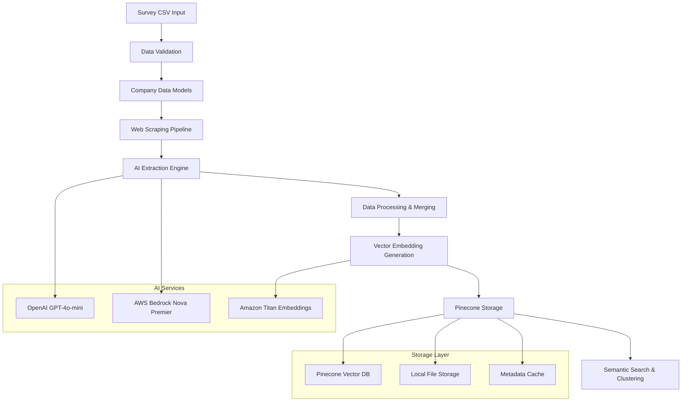

# Theodore System Architecture

## 🏗️ High-Level Architecture

Theodore implements a modular, event-driven architecture optimized for AI-powered company intelligence extraction and analysis.



## 🧩 Component Architecture

### 1. Data Layer (`src/models.py`)

**Purpose**: Centralized data validation and type safety using Pydantic models.

```python
# Core data structures
CompanyData              # Main company information container
CompanyIntelligenceConfig # System configuration and parameters
```

**Key Features:**
- Type validation and serialization
- Field constraints and defaults
- JSON schema generation for AI extraction
- Backwards compatibility handling

**Design Decisions:**
- Pydantic v2 for performance and validation
- Optional fields with sensible defaults
- Nested structures for complex data (leadership, services)

### 2. Web Scraping Layer (`src/crawl4ai_scraper.py`)

**Purpose**: AI-powered web content extraction with intelligent multi-page crawling.

```python
class Crawl4AICompanyScraper:
    """
    Multi-page crawler with AI extraction
    - Homepage, About, Services, Team, etc.
    - Schema-based structured extraction
    - Intelligent data merging
    """
```

**Architecture Flow:**
1. **URL Generation**: Creates target URLs from base domain
2. **Concurrent Crawling**: AsyncIO-based parallel page processing
3. **AI Extraction**: LLMExtractionStrategy with Pydantic schemas
4. **Data Merging**: Intelligent combination of multi-page data
5. **Quality Control**: Validation and error handling

**Technical Implementation:**
```python
# Schema-driven extraction
strategy = LLMExtractionStrategy(
    llm_config=LLMConfig(provider="openai/gpt-4o-mini"),
    schema=CompanyIntelligence.model_json_schema(),
    extraction_type="schema"
)

# Multi-page processing
target_pages = ["", "/about", "/services", "/team", "/contact"]
```

### 3. AI Analysis Layer (`src/bedrock_client.py`)

**Purpose**: Enterprise-grade AI analysis using AWS Bedrock and multi-model strategies.

```python
class BedrockClient:
    """
    AWS Bedrock integration for:
    - Comprehensive company analysis
    - Embedding generation
    - Structured data extraction
    """
```

**Multi-Model Strategy:**
- **OpenAI GPT-4o-mini**: Fast, accurate structured extraction
- **AWS Nova Premier**: Deep business analysis and insights
- **Amazon Titan**: High-quality embeddings for semantic search

**Analysis Pipeline:**
1. **Content Preprocessing**: Text cleaning and chunking
2. **Structured Analysis**: Predefined analysis prompts
3. **Embedding Generation**: Vector representation creation
4. **Quality Scoring**: Confidence and completeness metrics

### 4. Vector Storage Layer (`src/pinecone_client.py`)

**Purpose**: Optimized vector storage and semantic search capabilities.

```python
class PineconeClient:
    """
    Optimized vector operations:
    - Minimal metadata storage (5 key fields)
    - Efficient batch operations
    - Semantic search and filtering
    """
```

**Storage Optimization:**
```python
# Optimized metadata (5 fields vs 62+ original)
metadata = {
    "company_name": company.name,
    "industry": company.industry,
    "business_model": company.business_model,
    "target_market": company.target_market,
    "company_size": company.employee_count_range
}

# Full data stored separately for retrieval
full_data = self._prepare_complete_metadata(company)
```

**Key Features:**
- **Cost Optimization**: 90%+ reduction in metadata storage costs
- **Performance**: Fast filtering and retrieval
- **Scalability**: Batch operations for large datasets
- **Flexibility**: Hybrid storage approach

### 5. Orchestration Layer (`src/main_pipeline.py`)

**Purpose**: Main pipeline coordination and batch processing management.

```python
class TheodorePipeline:
    """
    Main orchestration:
    - Batch processing management
    - Error handling and recovery
    - Progress tracking and logging
    """
```

**Pipeline Flow:**
1. **Input Validation**: CSV parsing and data validation
2. **Batch Coordination**: Optimal batch sizing for API limits
3. **Parallel Processing**: Concurrent company processing
4. **Error Recovery**: Graceful handling of failures
5. **Result Aggregation**: Collection and storage of results

## 🔄 Data Flow Architecture

### Input Processing Flow
```
CSV File → Data Validation → CompanyData Objects → Processing Queue
```

### Company Processing Flow
```
CompanyData → Web Scraping → AI Extraction → Data Merging → Vector Storage
```

### Analysis Flow
```
Raw Content → Bedrock Analysis → Structured Insights → Embedding Generation
```

### Storage Flow
```
Company Data → Metadata Extraction → Vector Generation → Pinecone Upload
```

## 🚀 Performance Architecture

### Concurrency Model
- **AsyncIO**: Non-blocking I/O for web scraping
- **Batch Processing**: Optimal API utilization
- **Rate Limiting**: Respectful API usage
- **Connection Pooling**: Efficient resource management

### Memory Management
- **Streaming Processing**: Avoid loading entire datasets
- **Garbage Collection**: Explicit cleanup of large objects
- **Chunking**: Process data in manageable sizes
- **Caching**: Smart caching of repeated operations

### Error Handling Strategy
```python
# Multi-level error handling
try:
    result = await scrape_company_comprehensive(company)
except CrawlError as e:
    # Fallback to basic scraping
    result = await scrape_company_basic(company)
except Exception as e:
    # Log and continue with partial data
    company.scrape_status = "failed"
    company.scrape_error = str(e)
```

## 🔧 Configuration Architecture

### Environment-Based Configuration
```python
class CompanyIntelligenceConfig:
    # Processing limits
    max_companies: int = 100
    max_content_length: int = 50000
    
    # AI model selection
    primary_extraction_model: str = "openai/gpt-4o-mini"
    analysis_model: str = "anthropic.claude-3-sonnet-20240229-v1:0"
    
    # Storage optimization
    enable_vector_storage: bool = True
    enable_clustering: bool = True
```

### Deployment Configurations
- **Development**: Small batches, verbose logging
- **Production**: Optimized batches, error recovery
- **Lambda**: Serverless-optimized processing

## 🏛️ Design Patterns

### 1. Strategy Pattern
- **AI Model Selection**: Pluggable AI providers
- **Extraction Strategies**: Different extraction approaches
- **Storage Backends**: Multiple storage options

### 2. Pipeline Pattern
- **Sequential Processing**: Step-by-step data transformation
- **Error Boundaries**: Isolated failure handling
- **Progress Tracking**: Comprehensive monitoring

### 3. Factory Pattern
- **Client Creation**: AI service client initialization
- **Configuration Management**: Environment-specific setups

### 4. Observer Pattern
- **Progress Monitoring**: Real-time processing updates
- **Logging**: Comprehensive audit trails

## 🔒 Security Architecture

### API Key Management
- Environment variable isolation
- Rotation-ready configuration
- Service-specific credentials

### Data Privacy
- No sensitive data in logs
- Configurable content filtering
- GDPR-compliant data handling

### Network Security
- TLS-encrypted communications
- Rate limiting and backoff
- Timeout configurations

## 📈 Scalability Architecture

### Horizontal Scaling
- **Stateless Design**: No shared state between processes
- **Batch Parallelization**: Independent batch processing
- **Service Isolation**: Microservice-ready architecture

### Vertical Scaling
- **Memory Efficiency**: Optimized data structures
- **CPU Utilization**: Async processing for I/O operations
- **Storage Optimization**: Minimal metadata approach

### Cloud-Native Features
- **Lambda Compatible**: Serverless deployment ready
- **Container Friendly**: Docker-compatible architecture
- **Auto-scaling Ready**: Metrics-based scaling support

## 🔍 Monitoring Architecture

### Logging Strategy
```python
# Structured logging
logger.info("AI-extracting from {url}", extra={
    "company_name": company.name,
    "page_type": page_path,
    "extraction_model": "gpt-4o-mini"
})
```

### Metrics Collection
- Processing rates and success ratios
- API usage and cost tracking
- Error rates by component
- Performance bottleneck identification

### Health Checks
- Service connectivity validation
- API quota monitoring
- Storage capacity tracking
- Data quality metrics

## 🔮 Future Architecture Considerations

### Planned Enhancements
1. **Real-time Processing**: Event-driven company updates
2. **Multi-tenant Support**: Isolated customer environments
3. **Advanced Analytics**: ML-powered insights and predictions
4. **API Gateway**: RESTful API for external integrations

### Architectural Evolution
- **Microservices**: Service decomposition for scaling
- **Event Sourcing**: Audit trail and replay capabilities
- **CQRS**: Separate read/write optimizations
- **GraphQL**: Flexible data querying interface

---

*This architecture documentation reflects the current production-ready state of Theodore, optimized for AI-powered company intelligence extraction at scale.*