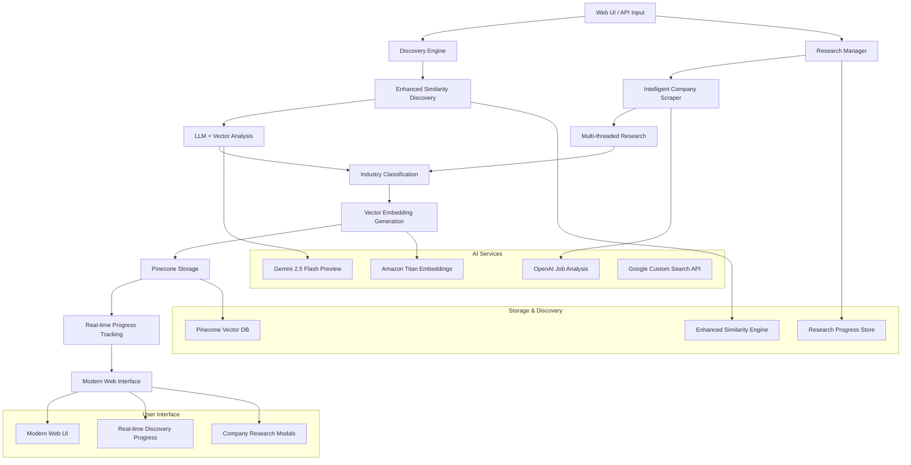

# Theodore System Architecture

## 🏗️ High-Level Architecture

Theodore implements a modular, event-driven architecture optimized for AI-powered company intelligence extraction, real-time research, and similarity discovery with a modern web interface.



## 🧩 Component Architecture

### 1. Data Layer (`src/models.py`)

**Purpose**: Centralized data validation and type safety using Pydantic models.

```python
# Core data structures
CompanyData              # Main company information container
CompanyIntelligenceConfig # System configuration and parameters
```

**Key Features:**
- Type validation and serialization
- Field constraints and defaults
- JSON schema generation for AI extraction
- Backwards compatibility handling

**Design Decisions:**
- Pydantic v2 for performance and validation
- Optional fields with sensible defaults
- Nested structures for complex data (leadership, services)

### 2. Web Scraping Layer (`src/crawl4ai_scraper.py`)

**Purpose**: AI-powered web content extraction with intelligent multi-page crawling.

```python
class Crawl4AICompanyScraper:
    """
    Multi-page crawler with AI extraction
    - Homepage, About, Services, Team, etc.
    - Schema-based structured extraction
    - Intelligent data merging
    """
```

**Architecture Flow:**
1. **URL Generation**: Creates target URLs from base domain
2. **Concurrent Crawling**: AsyncIO-based parallel page processing
3. **AI Extraction**: LLMExtractionStrategy with Pydantic schemas
4. **Data Merging**: Intelligent combination of multi-page data
5. **Quality Control**: Validation and error handling

**Technical Implementation:**
```python
# Schema-driven extraction
strategy = LLMExtractionStrategy(
    llm_config=LLMConfig(provider="openai/gpt-4o-mini"),
    schema=CompanyIntelligence.model_json_schema(),
    extraction_type="schema"
)

# Multi-page processing
target_pages = ["", "/about", "/services", "/team", "/contact"]
```

### 3. AI Analysis Layer (`src/bedrock_client.py`)

**Purpose**: Enterprise-grade AI analysis using AWS Bedrock and multi-model strategies.

```python
class BedrockClient:
    """
    AWS Bedrock integration for:
    - Comprehensive company analysis
    - Embedding generation
    - Structured data extraction
    """
```

**Multi-Model Strategy:**
- **OpenAI GPT-4o-mini**: Fast, accurate structured extraction
- **AWS Nova Pro**: Cost-optimized business analysis and insights (6x cheaper)
- **Amazon Titan**: High-quality embeddings for semantic search
- **Structured Research Prompts**: 8 predefined research categories

**Analysis Pipeline:**
1. **Content Preprocessing**: Text cleaning and chunking
2. **Structured Analysis**: Predefined analysis prompts
3. **Embedding Generation**: Vector representation creation
4. **Quality Scoring**: Confidence and completeness metrics

### 4. Vector Storage Layer (`src/pinecone_client.py`)

**Purpose**: Optimized vector storage and semantic search capabilities.

```python
class PineconeClient:
    """
    Optimized vector operations:
    - Minimal metadata storage (5 key fields)
    - Efficient batch operations
    - Semantic search and filtering
    """
```

**Storage Optimization:**
```python
# Optimized metadata (5 fields vs 62+ original)
metadata = {
    "company_name": company.name,
    "industry": company.industry,
    "business_model": company.business_model,
    "target_market": company.target_market,
    "company_size": company.employee_count_range
}

# Full data stored separately for retrieval
full_data = self._prepare_complete_metadata(company)
```

**Key Features:**
- **Cost Optimization**: 90%+ reduction in metadata storage costs
- **Performance**: Fast filtering and retrieval
- **Scalability**: Batch operations for large datasets
- **Flexibility**: Hybrid storage approach

### 5. Orchestration Layer (`src/main_pipeline.py`)

**Purpose**: Main pipeline coordination and batch processing management.

```python
class TheodorePipeline:
    """
    Main orchestration:
    - Batch processing management
    - Error handling and recovery
    - Progress tracking and logging
    """
```

**Pipeline Flow:**
1. **Input Validation**: CSV parsing and data validation
2. **Batch Coordination**: Optimal batch sizing for API limits
3. **Parallel Processing**: Concurrent company processing
4. **Error Recovery**: Graceful handling of failures
5. **Result Aggregation**: Collection and storage of results

## 🔄 Data Flow Architecture

### Input Processing Flow
```
CSV File → Data Validation → CompanyData Objects → Processing Queue
```

### Company Processing Flow
```
CompanyData → Web Scraping → AI Extraction → Data Merging → Vector Storage
```

### Analysis Flow
```
Raw Content → Bedrock Analysis → Structured Insights → Embedding Generation
```

### Storage Flow
```
Company Data → Metadata Extraction → Vector Generation → Pinecone Upload
```

## 🚀 Performance Architecture

### Concurrency Model
- **AsyncIO**: Non-blocking I/O for web scraping
- **Batch Processing**: Optimal API utilization
- **Rate Limiting**: Respectful API usage
- **Connection Pooling**: Efficient resource management

### Memory Management
- **Streaming Processing**: Avoid loading entire datasets
- **Garbage Collection**: Explicit cleanup of large objects
- **Chunking**: Process data in manageable sizes
- **Caching**: Smart caching of repeated operations

### Error Handling Strategy
```python
# Multi-level error handling
try:
    result = await scrape_company_comprehensive(company)
except CrawlError as e:
    # Fallback to basic scraping
    result = await scrape_company_basic(company)
except Exception as e:
    # Log and continue with partial data
    company.scrape_status = "failed"
    company.scrape_error = str(e)
```

## 🔧 Configuration Architecture

### Environment-Based Configuration
```python
class CompanyIntelligenceConfig:
    # Processing limits
    max_companies: int = 100
    max_content_length: int = 50000
    
    # AI model selection
    primary_extraction_model: str = "openai/gpt-4o-mini"
    analysis_model: str = "anthropic.claude-3-sonnet-20240229-v1:0"
    
    # Storage optimization
    enable_vector_storage: bool = True
    enable_clustering: bool = True
```

### Deployment Configurations
- **Development**: Small batches, verbose logging
- **Production**: Optimized batches, error recovery
- **Lambda**: Serverless-optimized processing

## 🏛️ Design Patterns

### 1. Strategy Pattern
- **AI Model Selection**: Pluggable AI providers
- **Extraction Strategies**: Different extraction approaches
- **Storage Backends**: Multiple storage options

### 2. Pipeline Pattern
- **Sequential Processing**: Step-by-step data transformation
- **Error Boundaries**: Isolated failure handling
- **Progress Tracking**: Comprehensive monitoring

### 3. Factory Pattern
- **Client Creation**: AI service client initialization
- **Configuration Management**: Environment-specific setups

### 4. Observer Pattern
- **Progress Monitoring**: Real-time processing updates
- **Logging**: Comprehensive audit trails

## 🔒 Security Architecture

### API Key Management
- Environment variable isolation
- Rotation-ready configuration
- Service-specific credentials

### Data Privacy
- No sensitive data in logs
- Configurable content filtering
- GDPR-compliant data handling

### Network Security
- TLS-encrypted communications
- Rate limiting and backoff
- Timeout configurations

## 📈 Scalability Architecture

### Horizontal Scaling
- **Stateless Design**: No shared state between processes
- **Batch Parallelization**: Independent batch processing
- **Service Isolation**: Microservice-ready architecture

### Vertical Scaling
- **Memory Efficiency**: Optimized data structures
- **CPU Utilization**: Async processing for I/O operations
- **Storage Optimization**: Minimal metadata approach

### Cloud-Native Features
- **Lambda Compatible**: Serverless deployment ready
- **Container Friendly**: Docker-compatible architecture
- **Auto-scaling Ready**: Metrics-based scaling support

## 🔍 Monitoring Architecture

### Logging Strategy
```python
# Structured logging
logger.info("AI-extracting from {url}", extra={
    "company_name": company.name,
    "page_type": page_path,
    "extraction_model": "gpt-4o-mini"
})
```

### Metrics Collection
- Processing rates and success ratios
- API usage and cost tracking
- Error rates by component
- Performance bottleneck identification

### Health Checks
- Service connectivity validation
- API quota monitoring
- Storage capacity tracking
- Data quality metrics

## 🚀 Enhanced Similarity Discovery System (`src/simple_enhanced_discovery.py`)

### Purpose
Advanced multi-source company discovery that combines LLM reasoning with vector similarity for comprehensive company intelligence gathering.

### Architecture
```python
class SimpleEnhancedDiscovery:
    """
    Enhanced discovery with dual-mode operation:
    - Known companies: LLM + Vector hybrid analysis
    - Unknown companies: LLM-only research with web scraping
    """
```

### Discovery Flow
1. **Company Lookup**: Check if target company exists in database
2. **Discovery Mode Selection**:
   - **Known Company Path**: Hybrid LLM + Vector similarity analysis
   - **Unknown Company Path**: LLM-only discovery with comprehensive web research
3. **Result Enhancement**: Enrich discoveries with business context and confidence scoring
4. **Quality Assurance**: Validate results and provide reasoning transparency

### Key Features
- **Dual-Mode Discovery**: Handles both indexed and unknown companies intelligently
- **LLM Reasoning**: Uses Claude Sonnet 4 for sophisticated business relationship analysis
- **Vector Similarity**: Leverages semantic embeddings for precise matching
- **Research Integration**: Automatically triggers web research for unknown companies
- **Confidence Scoring**: Provides transparency in discovery quality

## 🔬 Research Manager System (`src/research_manager.py`)

### Purpose
Orchestrates multithreaded company research with real-time progress tracking, intelligent industry classification, and comprehensive job listings analysis.

### Core Components

#### Research Status Tracking
```python
class ResearchStatus(str, Enum):
    UNKNOWN = "unknown"           # LLM-suggested company, not in database
    NOT_RESEARCHED = "not_researched"  # In database but lacks sales intelligence
    RESEARCHING = "researching"   # Currently being processed
    COMPLETED = "completed"       # Fully researched with sales intelligence
    FAILED = "failed"            # Research failed
    QUEUED = "queued"            # Waiting to be processed
```

#### Multithreaded Processing
- **ThreadPoolExecutor**: Up to 3 concurrent research operations
- **Progress Tracking**: Real-time status updates with phase-based progression
- **Error Recovery**: Graceful handling of research failures
- **Resource Management**: Controlled concurrency to respect API limits

#### Research Pipeline
1. **Company Profile Creation**: Initialize research target
2. **Intelligent Web Scraping**: Multi-page content extraction using Crawl4AI
3. **Job Listings Analysis**: Intelligent career page discovery and hiring insights
4. **Industry Classification**: LLM-based categorization using comprehensive research data
5. **Embedding Generation**: Create vector representations for similarity search
6. **Database Storage**: Persist enriched company data in Pinecone

### Job Listings Analysis System (`src/job_listings_crawler.py`)

**Purpose**: Intelligent career page discovery and hiring insights extraction using multi-step analysis and LLM guidance.

#### Core Features
- **Smart Homepage Analysis**: Automatically detects career-related links on company homepages
- **LLM-Guided Navigation**: Uses AI to identify the most likely career page from available links
- **Multi-Step Fallback**: Progressive approach with Google search fallback when direct crawling fails
- **Dual AI Provider Support**: Works with both OpenAI and AWS Bedrock for maximum flexibility

#### Crawling Process
```python
class JobListingsCrawler:
    """
    6-Step intelligent job listings discovery:
    1. Crawl main page for all links
    2. LLM selects most likely career page link
    3. Crawl career page for job listings
    4. If no listings found, LLM identifies job listing links
    5. Crawl specific job listing pages
    6. Google search fallback with actionable guidance
    """
```

#### Enhanced Fallback System
When direct career page crawling fails, the system provides actionable guidance:
- **Direct Career URLs**: AI-identified direct links to company career pages
- **Job Site Recommendations**: Platform-specific suggestions (LinkedIn, AngelList, etc.)
- **Search Tips**: Company-specific search strategies
- **Typical Roles**: Common positions the company hires for
- **Hiring Status Assessment**: Current hiring activity analysis

### Industry Classification System
```python
def _classify_industry(self, company: CompanyData) -> str:
    """
    Uses comprehensive research data for accurate industry classification:
    - Business overview and value proposition
    - Products, services, and competitive advantages
    - Technology stack and certifications
    - Partnerships and market presence
    - Anti-guessing logic for data quality
    """
```

## 🌐 Modern Web Interface (`static/js/app.js`, `static/css/style.css`)

### Design Philosophy
Modern, responsive interface with glass morphism design, real-time progress tracking, and installer-style user experience.

### Key UI Components

#### Discovery Progress System
- **5-Phase Progress**: Initialize → Database Check → AI Research → Enhance → Complete
- **Real-time Updates**: Live progress bars with percentage completion
- **Company Discovery Tracking**: Shows discovered companies as they're found
- **Installer-Style UX**: Transforms waiting time into engaging experience

#### Modal System
```javascript
function showCompanyDetailsModal(company) {
    // Large, scrollable modals for comprehensive company information
    // Glass morphism styling with backdrop blur
    // Responsive design for all screen sizes
}
```

#### Search Intelligence
- **Smart Suggestions**: Context-aware company recommendations
- **Request Cancellation**: Prevents suggestion flickering with rapid typing
- **Fallback Handling**: Graceful degradation for unknown companies

### CSS Architecture
- **Glass Morphism**: Modern translucent design with backdrop filters
- **Gradient Animations**: Shimmer effects and animated progress indicators
- **Responsive Grid**: Flexible layouts that adapt to all screen sizes
- **Dark Theme Optimized**: WCAG-compliant high contrast with accessible color schemes
- **Smart Color System**: Light blue (#60a5fa) links for perfect dark mode visibility
- **Interactive Elements**: Green website buttons with hover effects and transitions

## 🤖 Industry Classification Pipeline (`src/similarity_prompts.py`)

### Enhanced Classification Prompt
```python
INDUSTRY_CLASSIFICATION_FROM_RESEARCH_PROMPT = """
Based on the comprehensive company research data provided below, determine what industry this company operates in. 
Use ALL the detailed information provided - not just the company name - to make an accurate classification.

If the research data clearly indicates the industry through products, services, partnerships, or certifications, provide that classification.
If the data is insufficient or unclear, respond with "Insufficient Data" rather than guessing.
"""
```

### Anti-Guessing Logic
- **Evidence-Based Classification**: Requires strong indicators from research data
- **Insufficient Data Handling**: Explicit handling of uncertain classifications
- **Comprehensive Data Analysis**: Uses all available research fields for decision-making

## 🔄 Real-Time Progress Tracking

### Progress Architecture
```javascript
// Installer-style progress with 5 distinct phases
const discoveryPhases = [
    { name: 'Initialize', duration: 10 },
    { name: 'Database Check', duration: 20 },
    { name: 'AI Research', duration: 40 },
    { name: 'Enhance', duration: 20 },
    { name: 'Complete', duration: 10 }
];
```

### Features
- **Phase-Based Progression**: Clear milestones for user understanding
- **Discovery Stats**: Real-time count of companies found during research
- **Visual Feedback**: Animated progress bars with shimmer effects
- **Error Handling**: Graceful failure states with retry options

## 📊 API Integration Architecture (`app.py`)

### Enhanced Endpoints
- **`/api/discover`**: Multi-source company discovery with fallback logic
- **`/api/research/start`**: Single company research initiation
- **`/api/research/bulk`**: Multi-company research orchestration
- **`/api/research/progress`**: Real-time progress monitoring
- **`/api/classify-unknown-industries`**: Bulk industry classification for existing companies

### Research Manager Integration
```python
# Initialization with dependency injection
pipeline.research_manager = ResearchManager(
    intelligent_scraper=pipeline.scraper,
    pinecone_client=pipeline.pinecone_client,
    bedrock_client=pipeline.bedrock_client
)
```

## 🔧 Configuration Management

### Environment-Based Setup
```python
class CompanyIntelligenceConfig:
    # AI model selection for different use cases
    bedrock_analysis_model: str = "anthropic.claude-3-sonnet-20240229-v1:0"
    bedrock_embedding_model: str = "amazon.titan-embed-text-v1"
    
    # Research processing controls
    max_content_length: int = 50000
    request_timeout: int = 10
    requests_per_second: float = 2.0
```

## 🔮 Future Architecture Considerations

### Planned Enhancements
1. **Real-time Processing**: Event-driven company updates
2. **Multi-tenant Support**: Isolated customer environments
3. **Advanced Analytics**: ML-powered insights and predictions
4. **API Gateway**: RESTful API for external integrations

### Architectural Evolution
- **Microservices**: Service decomposition for scaling
- **Event Sourcing**: Audit trail and replay capabilities
- **CQRS**: Separate read/write optimizations
- **GraphQL**: Flexible data querying interface

## 📈 Performance Optimizations

### Implemented Optimizations
- **Concurrent Research**: ThreadPoolExecutor for parallel company processing
- **Request Cancellation**: Prevents UI flickering and reduces API calls
- **Smart Caching**: Intelligent data reuse to minimize redundant operations
- **Progress Streaming**: Real-time updates without polling overhead

### Scalability Features
- **Configurable Concurrency**: Adjustable thread pool sizing
- **Rate Limiting**: Respectful API usage with backoff strategies
- **Memory Management**: Efficient handling of large research datasets
- **Error Recovery**: Robust failure handling with retry mechanisms

---

*This architecture documentation reflects the current production-ready state of Theodore, featuring enhanced similarity discovery, real-time research management, and a modern web interface optimized for AI-powered company intelligence extraction at scale.*