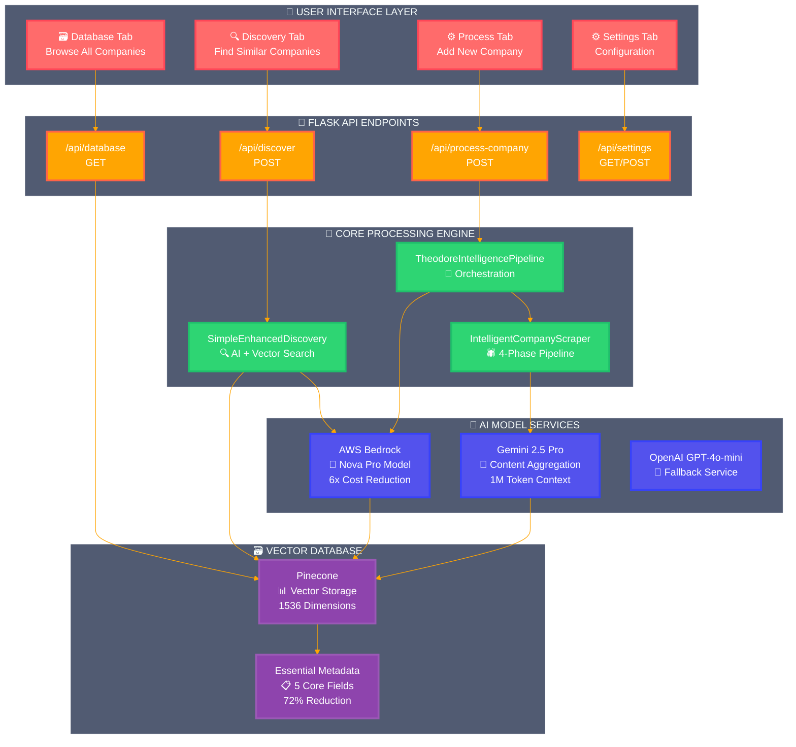
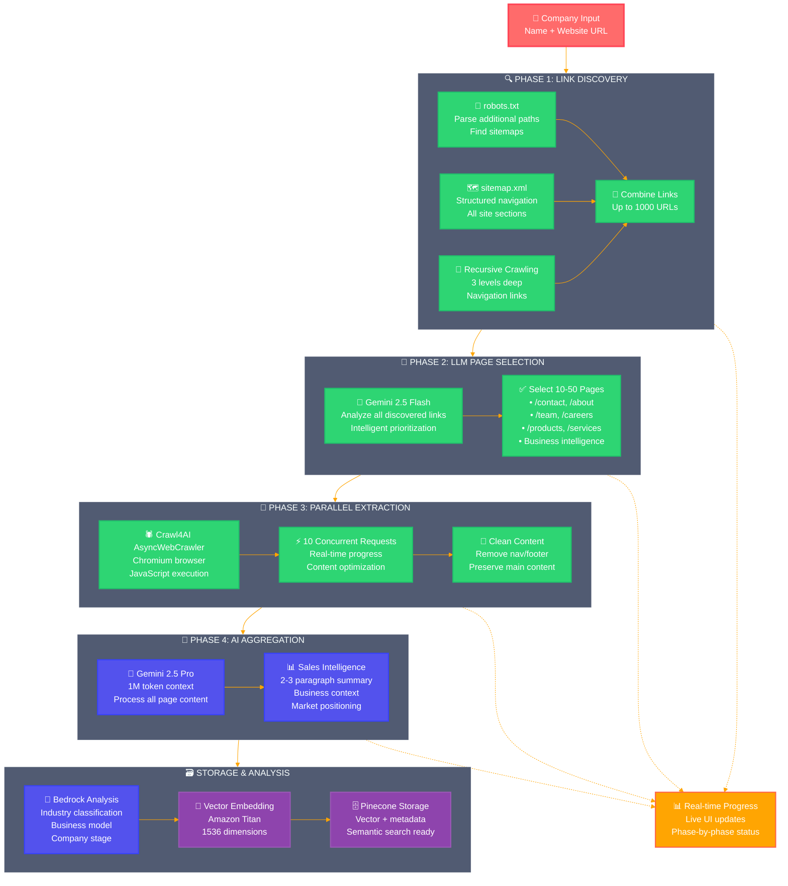
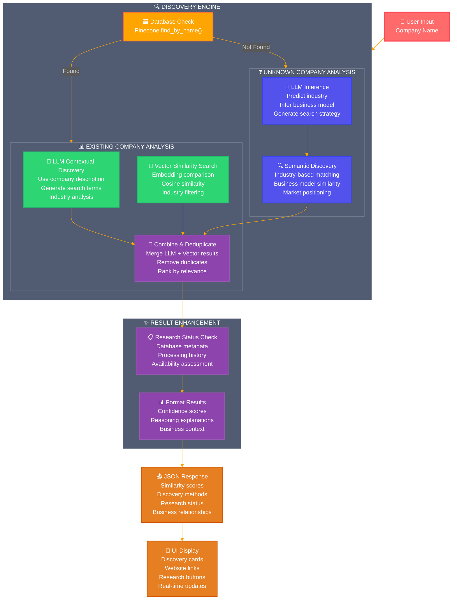
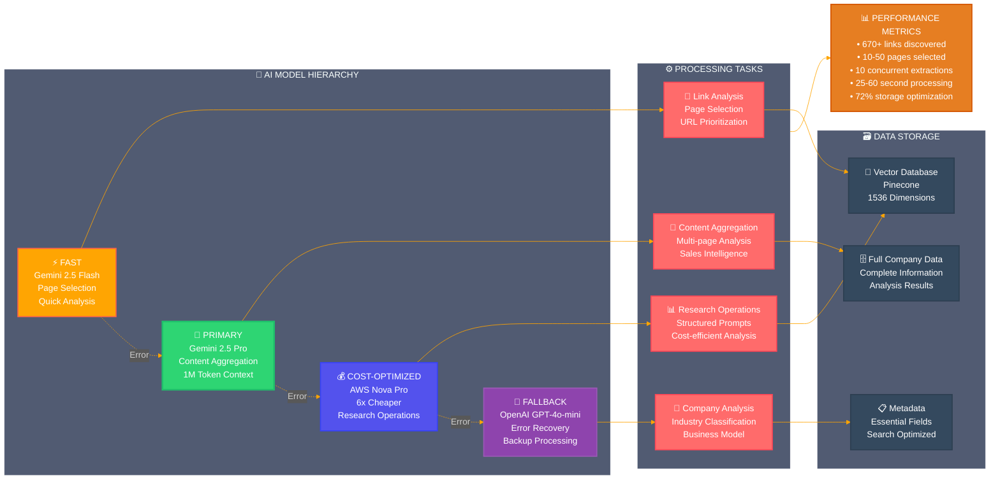
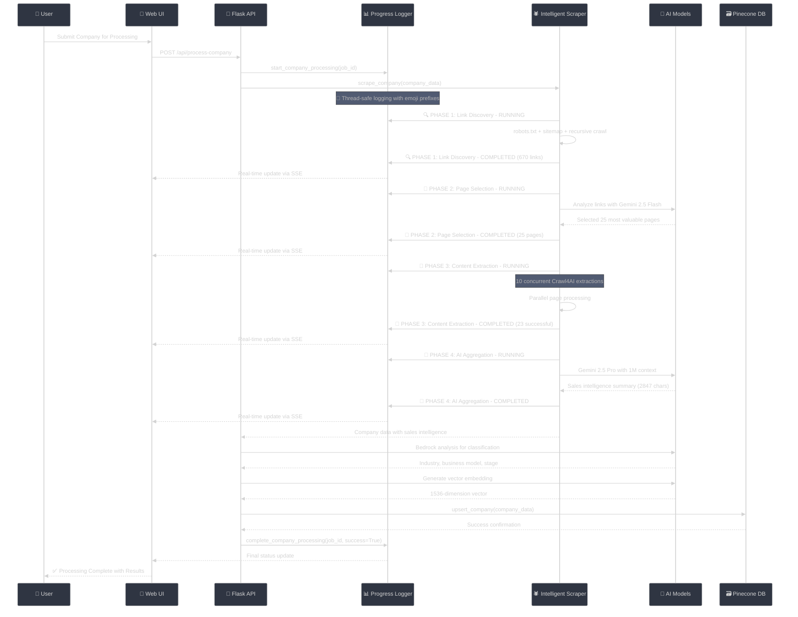

# 🔄 Theodore Company Data Retrieval - Mermaid Diagrams

High-contrast Mermaid diagrams documenting Theodore's company data retrieval process.

## 📊 Complete System Architecture

## 🔄 4-Phase Intelligent Scraping Pipeline

## 🔍 Company Discovery Workflow

## 🤖 AI Model Hierarchy & Data Flow

## 📊 Real-time Progress Tracking

These high-contrast Mermaid diagrams provide clear visual documentation of Theodore's company data retrieval process, optimized for readability with distinct colors and comprehensive flow representations.