# Theodore Company Research Flow

This document visualizes how Theodore researches a single company using its 4-phase intelligent scraping system.

## High-Level Research Flow (v2 with MCP)

```mermaid
graph TB
    %% Entry Points
    UI[Web UI Button] --> API[/api/process-company]
    CLI[CLI Command] --> API
    Batch[Batch Processor] --> Pipeline
    
    %% Main Flow
    API --> URLCheck{Website URL Provided?}
    URLCheck -->|No| Discovery[Domain Discovery]
    URLCheck -->|Yes| JobID[Create Job ID & Start Progress Tracking]
    
    Discovery --> Search[DuckDuckGo Search]
    Search --> TestURLs[Test Potential Domains]
    TestURLs --> JobID
    
    JobID --> Pipeline[process_single_company]
    
    %% Pipeline Components
    Pipeline --> Check{Company Exists?}
    Check -->|Yes| Load[Load Existing Company]
    Check -->|No| Create[Create New Company]
    
    Load --> Enrich{Need More Data?}
    Create --> Scraper
    
    Enrich -->|Yes| Scraper
    Enrich -->|No| MCPDiscovery
    
    %% 4-Phase Scraping
    Scraper[IntelligentCompanyScraper] --> Phase1
    
    subgraph "4-Phase Intelligent Scraping"
        Phase1[🔍 Phase 1: Link Discovery]
        Phase2[🧠 Phase 2: LLM Page Selection]
        Phase3[📄 Phase 3: Parallel Content Extraction]
        Phase4[🧠 Phase 4: LLM Content Aggregation]
        
        Phase1 --> Phase2
        Phase2 --> Phase3
        Phase3 --> Phase4
    end
    
    Phase4 --> Analysis[AI Business Analysis - Nova Pro]
    Analysis --> Classification[SaaS Classification]
    Classification --> Embedding[Generate Embeddings - Nova Pro]
    Embedding --> Pinecone[Store in Pinecone]
    
    %% MCP Discovery Path
    Pinecone --> MCPDiscovery{Discover Similar?}
    MCPDiscovery -->|Yes| MCPRegistry[MCP Tool Registry]
    MCPDiscovery -->|No| Response[Return CompanyData]
    
    subgraph "MCP Search Architecture"
        MCPRegistry --> MCPTools[Select Enabled Tools]
        MCPTools --> Perplexity[Perplexity Droid]
        MCPTools --> Tavily[Tavily Droid]
        MCPTools --> Custom[Custom Droids]
        
        Perplexity --> MCPAggregator
        Tavily --> MCPAggregator
        Custom --> MCPAggregator
        
        MCPAggregator[MCP Result Aggregator] --> SimilarCompanies[Similar Companies List]
    end
    
    SimilarCompanies --> Response
    
    %% Error Handling
    Scraper -.->|Failure| ErrorResponse[Return Error]
    
    %% Progress Updates
    Phase1 -.-> Progress[Progress Logger]
    Phase2 -.-> Progress
    Phase3 -.-> Progress
    Phase4 -.-> Progress
    MCPTools -.-> Progress
    Progress -.-> SSE[Server-Sent Events]
    SSE -.-> UI
```

## Domain Discovery Process

When no website URL is provided for a company, Theodore automatically attempts to discover it:

```mermaid
flowchart TD
    Start[Company Name Only] --> DDG[DuckDuckGo Search]
    
    DDG --> Query[Search: "Company Name official website"]
    Query --> Parse[Parse Search Results]
    Parse --> Filter[Filter Out Social Media Sites]
    
    Filter --> Found{Domain Found?}
    Found -->|Yes| Validate[Validate Domain]
    Found -->|No| Construct[Construct Potential URLs]
    
    Construct --> Variants[Generate URL Variants]
    Variants --> Test1[companyname.com]
    Variants --> Test2[www.companyname.com]
    Variants --> Test3[companyname.ca]
    Variants --> Test4[www.companyname.ca]
    
    Test1 --> HTTPTest[HTTP HEAD Request]
    Test2 --> HTTPTest
    Test3 --> HTTPTest
    Test4 --> HTTPTest
    
    HTTPTest --> Success{Response < 400?}
    Success -->|Yes| UseURL[Use This URL]
    Success -->|No| NextURL[Try Next URL]
    
    NextURL --> NoURL{All URLs Tested?}
    NoURL -->|Yes| Error[Return Error: Please provide URL]
    NoURL -->|No| HTTPTest
    
    UseURL --> Continue[Continue with Research]
    Validate --> Continue
```

### Domain Discovery Details:
1. **Primary Method**: DuckDuckGo search (no rate limiting)
2. **Search Query**: "{Company Name} official website"
3. **Blocked Domains**: Wikipedia, LinkedIn, Facebook, Twitter
4. **Fallback Method**: Test common domain patterns (.com, .ca)
5. **Validation**: HTTP HEAD request to verify domain exists

## MCP-First Similarity Discovery Architecture

Theodore v2 uses a pluggable MCP (Model Context Protocol) search droid architecture for finding similar companies. This allows users to configure and use their preferred search tools while maintaining a consistent interface.


### MCP Tool Registry Configuration:
```yaml
mcp_tools:
  perplexity_search:
    enabled: true
    version: "1.0"
    capabilities: ["web_search", "news_search", "company_data"]
    config:
      model: "sonar-medium"
      search_depth: "comprehensive"
      max_results: 10
  
  tavily_api:
    enabled: true
    version: "2.0"
    capabilities: ["web_search", "domain_filter", "date_filter"]
    config:
      search_depth: 2
      include_domains: ["techcrunch.com", "bloomberg.com"]
      exclude_domains: ["wikipedia.org"]
  
  custom_enterprise:
    enabled: false
    version: "1.0"
    capabilities: ["internal_search", "crm_data", "market_intelligence"]
    config:
      api_endpoint: "https://enterprise.example.com/search"
      auth_method: "oauth2"
```

### MCP Search Flow:
1. **Tool Selection**: Registry checks enabled MCP tools
2. **Parallel Execution**: Multiple tools search simultaneously
3. **Result Aggregation**: Combine and deduplicate results
4. **Confidence Scoring**: Merge scores from different tools
5. **Attribution**: Track which tool found each company

### Legacy Fallback Configuration:
When no MCP tools are available, the system falls back to legacy methods:
1. **Primary**: Google Custom Search API
2. **Secondary**: SerpAPI
3. **Fallback**: DuckDuckGo HTML scraping

### Search Query Generation (MCP-aware):
The LLM generates tool-specific queries based on each tool's capabilities:
- **Perplexity**: "Find CRM companies similar to Salesforce with recent funding"
- **Tavily**: "site:techcrunch.com OR site:bloomberg.com Salesforce competitors"
- **Custom**: Internal query format specific to enterprise search

## Detailed 4-Phase Scraping Process

```mermaid
flowchart TD
    Start[Start Scraping] --> Config[Configure Scraper]
    
    Config --> P1Start[Phase 1: Link Discovery]
    
    subgraph Phase1["🔍 Phase 1: Comprehensive Link Discovery"]
        P1Start --> Robots[Parse robots.txt]
        P1Start --> Sitemap[Parse sitemap.xml]
        P1Start --> Crawl[Recursive Web Crawl]
        
        Robots --> Links1[Extract URLs]
        Sitemap --> Links2[Extract URLs]
        Crawl --> Links3[Discover Links]
        
        Links1 --> Merge[Merge & Deduplicate]
        Links2 --> Merge
        Links3 --> Merge
        
        Merge --> Filter[Filter Invalid URLs]
        Filter --> AllLinks[All Links Pool<br/>Up to 1000 URLs]
    end
    
    AllLinks --> P2Start[Phase 2: Page Selection]
    
    subgraph Phase2["🧠 Phase 2: LLM-Driven Page Selection"]
        P2Start --> Prompt[Generate Selection Prompt]
        Prompt --> LLMSelect[Gemini 2.5 Pro Analysis]
        
        LLMSelect --> Priority[Prioritize Pages by Value]
        Priority --> Select50[Select Top 50 Pages]
        
        Select50 --> Targets{Target Pages}
        Targets --> Contact[/contact, /about]
        Targets --> Team[/team, /leadership]
        Targets --> Products[/products, /services]
        Targets --> Careers[/careers, /jobs]
    end
    
    Select50 --> P3Start[Phase 3: Content Extraction]
    
    subgraph Phase3["📄 Phase 3: Parallel Content Extraction"]
        P3Start --> Semaphore[Semaphore(10)]
        Semaphore --> Concurrent[10 Concurrent Crawlers]
        
        Concurrent --> Extract1[Extract Page 1]
        Concurrent --> Extract2[Extract Page 2]
        Concurrent --> ExtractN[Extract Page N]
        
        Extract1 --> Clean1[Clean HTML]
        Extract2 --> Clean2[Clean HTML]
        ExtractN --> CleanN[Clean HTML]
        
        Clean1 --> Content[Content Pool]
        Clean2 --> Content
        CleanN --> Content
        
        Content --> Limit[10K chars/page limit]
    end
    
    Content --> P4Start[Phase 4: AI Analysis]
    
    subgraph Phase4["🧠 Phase 4: LLM Content Aggregation"]
        P4Start --> Combine[Combine All Content]
        Combine --> Token[1M Token Context]
        Token --> GeminiAnalyze[Gemini 2.5 Pro]
        
        GeminiAnalyze --> Intelligence[Sales Intelligence]
        Intelligence --> Structure[Structured Data]
        
        Structure --> Overview[Company Overview]
        Structure --> Model[Business Model]
        Structure --> Market[Target Market]
        Structure --> Tech[Tech Assessment]
    end
    
    Structure --> Complete[Scraping Complete]
```

## AI Analysis Pipeline

```mermaid
flowchart TB
    subgraph Input["📥 Input Data"]
        RawContent[Raw Scraped Content<br/>from 4-Phase Scraping]
        CompanyInfo[Company Name & Website]
    end
    
    Input --> NovaProAnalysis
    
    subgraph NovaProAnalysis["🧠 Nova Pro AI Analysis"]
        Analyze[analyze_company_content]
        Analyze --> Extract[Extract Structured Fields]
        
        subgraph Fields["Extracted Fields"]
            Industry[🏭 Industry]
            BizModel[💼 Business Model]
            Size[📊 Company Size]
            Services[🛠️ Key Services]
            Target[🎯 Target Market]
        end
        
        Extract --> Fields
    end
    
    NovaProAnalysis --> SaaSClassifier
    
    subgraph SaaSClassifier["🏷️ SaaS Classification"]
        Classify[classify_company method]
        Classify --> ClassResults[Classification Results]
        
        subgraph Results["Classification Output"]
            Category[📁 SaaS Category<br/>e.g., CRM, Marketing, Analytics]
            Confidence[📊 Confidence Score<br/>0.0 - 1.0]
            IsSaaS[✅ Is SaaS?<br/>True/False]
        end
        
        ClassResults --> Results
    end
    
    SaaSClassifier --> EmbeddingGen
    
    subgraph EmbeddingGen["🔢 Embedding Generation (Nova Pro)"]
        PrepText[Prepare Embedding Text]
        PrepText --> |Clean & Format| GenEmbed[Generate Embedding<br/>via AWS Bedrock]
        GenEmbed --> Vector[1536-dimensional Vector]
    end
    
    EmbeddingGen --> Storage
    
    subgraph Storage["💾 Pinecone Storage"]
        Upsert[upsert_company method]
        
        Upsert --> StoreOps[Storage Operations]
        
        subgraph Operations["What Gets Stored"]
            Metadata[📋 Company Metadata<br/>All extracted fields]
            VectorDB[🔢 Embedding Vector<br/>For similarity search]
            CompanyID[🆔 Unique Company ID]
        end
        
        StoreOps --> Operations
    end
    
    Storage --> Done[✅ Company Data Saved]
```



## Progress Tracking & Real-time Updates


## Data Flow Summary

1. **Input**: Company name (website URL optional)
2. **Domain Discovery** (if no URL provided):
   - 🔍 DuckDuckGo search for official website
   - 🧪 Test common domain patterns (.com, .ca)
   - ✅ Validate domain with HTTP request
3. **Job Creation**: Unique job_id for progress tracking
4. **4-Phase Scraping**:
   - 🔍 Discover up to 1000 links from multiple sources
   - 🧠 LLM selects 50 most valuable pages (Gemini 2.5 Pro)
   - 📄 Parallel extraction with 10 concurrent workers
   - 🧠 AI aggregates content into business intelligence (Gemini 2.5 Pro)
4. **AI Analysis**: Extract structured fields using AWS Bedrock Nova Pro
5. **Classification**: Determine SaaS category and confidence
6. **Embedding**: Generate vector for similarity search (AWS Bedrock Nova Pro)
7. **Storage**: Save to Pinecone with full metadata
8. **Response**: Return enriched CompanyData object

## Key Components

### Core Research Components
- **IntelligentCompanyScraper**: 4-phase web scraping orchestrator
- **discover_company_domain**: Automatic domain discovery when URL not provided (DuckDuckGo)
- **BedrockClient**: AWS Bedrock Nova Pro for business analysis & embeddings
- **GeminiClient**: Google Gemini 2.5 Pro for content aggregation & page selection
- **PineconeClient**: Vector database for storage & search
- **ProgressLogger**: Real-time progress tracking
- **SSE**: Server-Sent Events for UI updates

### MCP Search Architecture (v2)
- **MCPSearchToolPort**: Standard interface for all MCP search tools
- **MCPToolRegistry**: Manages available MCP tools and their configurations
- **MCPResultAggregator**: Combines and deduplicates results from multiple tools
- **PerplexityAdapter**: MCP adapter for Perplexity AI search
- **TavilyAdapter**: MCP adapter for Tavily search API
- **CustomMCPAdapter**: Base class for custom enterprise search tools

### Legacy Search Components (Fallback)
- **SimpleEnhancedDiscovery**: Legacy similarity discovery implementation
- **Google Search APIs**: Custom Search API or SerpAPI for finding similar companies

## Performance Characteristics

- **Total Time**: 20-35 seconds per company
- **Domain Discovery** (if no URL): 2-5 seconds
  - DuckDuckGo search: 1-3 seconds
  - URL validation: 1-2 seconds
- **Link Discovery**: 3-5 seconds
- **Page Selection**: 2-3 seconds
- **Content Extraction**: 5-15 seconds (parallel)
- **AI Analysis**: 8-10 seconds
- **Concurrent Limit**: 10 pages at once
- **Max Pages**: 50 per company
- **Token Context**: 1M tokens (Gemini 2.5 Pro)