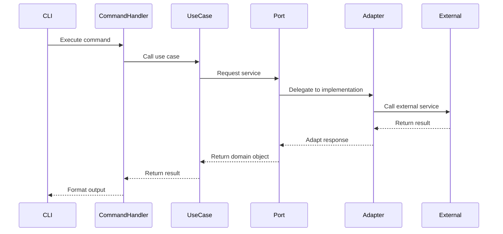
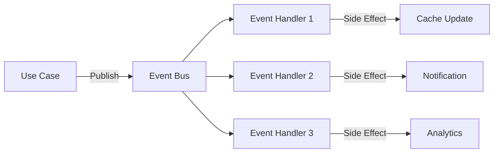
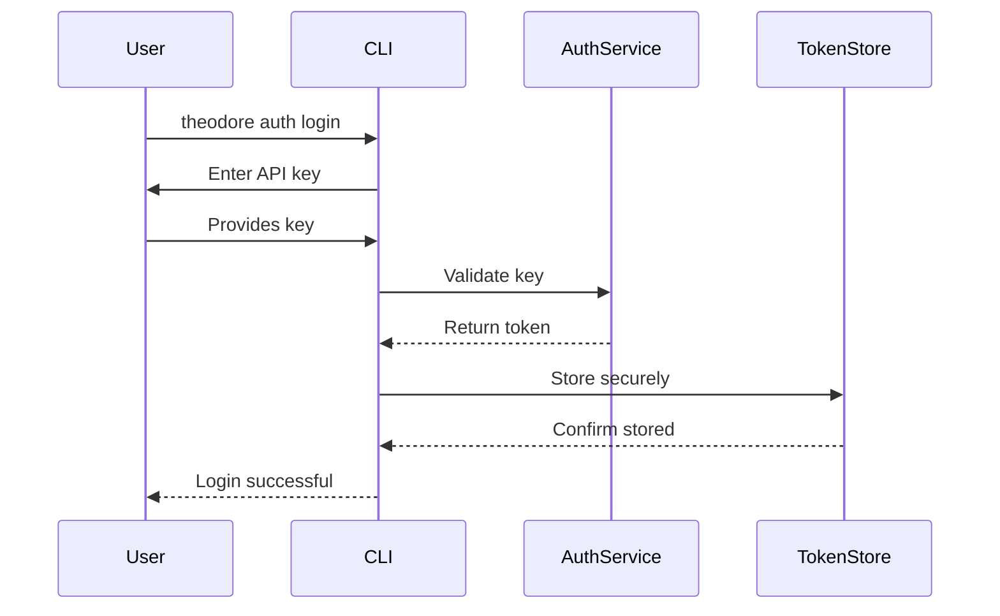

# Theodore v2 Technical Architecture Document

## 1. System Overview

### 1.1 Architecture Principles

1. **Separation of Concerns**: Clear boundaries between layers
2. **Dependency Inversion**: Depend on abstractions, not concretions
3. **Single Responsibility**: Each component has one reason to change
4. **Open/Closed**: Open for extension, closed for modification
5. **Interface Segregation**: Specific interfaces over general ones

### 1.2 High-Level Architecture

```
┌─────────────────────────────────────────────────────────┐
│                   External Interfaces                    │
├─────────────────┬───────────────────┬───────────────────┤
│       CLI       │    REST API       │    WebSocket      │
│     (Click)     │   (FastAPI)       │  (Real-time)      │
└─────────────────┴───────────────────┴───────────────────┘
                           │
┌──────────────────────────▼──────────────────────────────┐
│                  Application Layer                       │
│  ┌─────────────────────────────────────────────────┐   │
│  │            Command Handlers                      │   │
│  │  (research_cmd, discover_cmd, export_cmd)       │   │
│  └─────────────────────────────────────────────────┘   │
└─────────────────────────────────────────────────────────┘
                           │
┌──────────────────────────▼──────────────────────────────┐
│                   Domain Layer                           │
│  ┌──────────────┐  ┌──────────────┐  ┌─────────────┐  │
│  │  Use Cases   │  │   Entities   │  │   Domain    │  │
│  │              │  │              │  │   Events    │  │
│  └──────────────┘  └──────────────┘  └─────────────┘  │
└─────────────────────────────────────────────────────────┘
                           │
┌──────────────────────────▼──────────────────────────────┐
│                 Infrastructure Layer                     │
│  ┌───────────┐  ┌────────────┐  ┌──────────────────┐  │
│  │ Adapters  │  │ Repositories│  │ External Services│  │
│  │           │  │             │  │                  │  │
│  └───────────┘  └────────────┘  └──────────────────┘  │
└─────────────────────────────────────────────────────────┘
```

## 2. Component Architecture

### 2.1 Core Components

#### 2.1.1 CLI Layer
```python
theodore/
├── cli/
│   ├── __init__.py
│   ├── main.py              # Entry point
│   ├── commands/
│   │   ├── research.py      # Research commands
│   │   ├── discover.py      # Discovery commands
│   │   ├── export.py        # Export commands
│   │   └── config.py        # Configuration commands
│   └── utils/
│       ├── formatters.py    # Output formatters
│       ├── progress.py      # Progress indicators
│       └── validators.py    # Input validation
```

#### 2.1.2 Domain Layer
```python
theodore/
├── core/
│   ├── domain/
│   │   ├── entities/
│   │   │   ├── company.py
│   │   │   ├── research.py
│   │   │   └── intelligence.py
│   │   ├── value_objects/
│   │   │   ├── website.py
│   │   │   ├── industry.py
│   │   │   └── embedding.py
│   │   └── events/
│   │       ├── company_researched.py
│   │       └── research_failed.py
│   ├── use_cases/
│   │   ├── research_company.py
│   │   ├── discover_similar.py
│   │   └── export_data.py
│   └── interfaces/          # Ports
│       ├── scraper.py
│       ├── ai_provider.py
│       ├── storage.py
│       └── cache.py
```

#### 2.1.3 Infrastructure Layer
```python
theodore/
├── infrastructure/
│   ├── adapters/
│   │   ├── scrapers/
│   │   │   ├── crawl4ai.py
│   │   │   └── playwright.py
│   │   ├── ai_providers/
│   │   │   ├── bedrock.py
│   │   │   ├── gemini.py
│   │   │   └── openai.py
│   │   └── storage/
│   │       ├── postgres.py
│   │       └── pinecone.py
│   ├── config/
│   │   ├── settings.py
│   │   └── container.py    # DI container
│   └── services/
│       ├── queue.py
│       ├── cache.py
│       └── event_bus.py
```

### 2.2 Plugin Architecture

#### 2.2.1 Plugin Structure
```python
theodore/
├── plugins/
│   ├── base.py             # Base plugin class
│   ├── manager.py          # Plugin lifecycle
│   ├── registry.py         # Service registry
│   ├── loader.py           # Dynamic loading
│   └── sandbox.py          # Security sandbox
```

#### 2.2.2 Plugin Interface
```python
class Plugin(ABC):
    @abstractmethod
    def get_metadata(self) -> PluginMetadata:
        """Return plugin metadata"""
        pass
    
    @abstractmethod
    def get_provided_interfaces(self) -> Dict[Type, Type]:
        """Map of interface to implementation"""
        pass
    
    @abstractmethod
    def initialize(self, container: Container) -> None:
        """Initialize with DI container"""
        pass
```

## 3. Data Flow Architecture

### 3.1 Command Execution Flow



### 3.2 Event-Driven Flow



## 4. Database Architecture

### 4.1 Schema Design

#### 4.1.1 PostgreSQL Schema
```sql
-- Companies table
CREATE TABLE companies (
    id UUID PRIMARY KEY DEFAULT gen_random_uuid(),
    name VARCHAR(255) NOT NULL,
    website VARCHAR(255) UNIQUE NOT NULL,
    industry VARCHAR(100),
    business_model VARCHAR(100),
    company_size VARCHAR(50),
    founded_year INTEGER,
    created_at TIMESTAMP DEFAULT NOW(),
    updated_at TIMESTAMP DEFAULT NOW()
);

-- Research results
CREATE TABLE research_results (
    id UUID PRIMARY KEY DEFAULT gen_random_uuid(),
    company_id UUID REFERENCES companies(id),
    scrape_status VARCHAR(50),
    pages_scraped INTEGER,
    processing_time FLOAT,
    ai_summary TEXT,
    raw_data JSONB,
    created_at TIMESTAMP DEFAULT NOW()
);

-- Plugin data
CREATE TABLE plugin_data (
    id UUID PRIMARY KEY DEFAULT gen_random_uuid(),
    plugin_name VARCHAR(100),
    company_id UUID REFERENCES companies(id),
    data JSONB,
    created_at TIMESTAMP DEFAULT NOW()
);
```

#### 4.1.2 Vector Database Schema
```python
{
    "index_name": "theodore-companies",
    "dimension": 1536,
    "metric": "cosine",
    "metadata_config": {
        "indexed": ["industry", "business_model", "company_size"]
    }
}
```

### 4.2 Caching Strategy

#### 4.2.1 Cache Layers
1. **L1 Cache**: In-memory (process-local)
2. **L2 Cache**: Redis (shared)
3. **L3 Cache**: Database

#### 4.2.2 Cache Keys
```python
# Company data
company:{company_id}:data
company:{website}:id

# Research results  
research:{company_id}:latest
research:{company_id}:{timestamp}

# Discovery results
discovery:{company_id}:similar:{limit}
```

## 5. API Architecture

### 5.1 REST API Design

#### 5.1.1 Endpoints
```yaml
/api/v2:
  /companies:
    GET: List companies
    POST: Create company
  /companies/{id}:
    GET: Get company details
    PUT: Update company
    DELETE: Delete company
  /research:
    POST: Start research
    GET: Get research status
  /research/{task_id}:
    GET: Get research result
  /discovery:
    POST: Find similar companies
  /export:
    POST: Export data
    GET: Download export
```

#### 5.1.2 Response Format
```json
{
    "success": true,
    "data": {
        "id": "123e4567-e89b-12d3-a456-426614174000",
        "type": "company",
        "attributes": {
            "name": "Acme Corp",
            "website": "https://acme.com"
        }
    },
    "meta": {
        "version": "2.0.0",
        "timestamp": "2024-01-20T10:30:00Z"
    }
}
```

### 5.2 WebSocket Architecture

#### 5.2.1 Event Types
```python
class EventType(Enum):
    RESEARCH_STARTED = "research.started"
    RESEARCH_PROGRESS = "research.progress"
    RESEARCH_COMPLETED = "research.completed"
    RESEARCH_FAILED = "research.failed"
```

#### 5.2.2 Message Format
```json
{
    "event": "research.progress",
    "data": {
        "task_id": "123e4567",
        "phase": "content_extraction",
        "progress": 0.75,
        "message": "Extracting page 18 of 25"
    }
}
```

## 6. Security Architecture

### 6.1 Authentication Flow


### 6.2 Plugin Security

#### 6.2.1 Sandbox Restrictions
- No filesystem access outside designated directory
- Network access only to whitelisted domains
- Resource limits (CPU, memory, time)
- No system calls

#### 6.2.2 Permission Model
```python
class PluginPermissions:
    READ_COMPANIES = "companies:read"
    WRITE_COMPANIES = "companies:write"
    NETWORK_ACCESS = "network:access"
    CACHE_ACCESS = "cache:access"
```

## 7. Performance Architecture

### 7.1 Optimization Strategies

#### 7.1.1 Concurrent Processing
```python
async def process_batch(companies: List[Company]):
    tasks = []
    semaphore = asyncio.Semaphore(10)  # Limit concurrency
    
    async def process_with_limit(company):
        async with semaphore:
            return await research_company(company)
    
    for company in companies:
        tasks.append(process_with_limit(company))
    
    return await asyncio.gather(*tasks)
```

#### 7.1.2 Resource Pooling
- Connection pools for database
- HTTP client connection reuse
- Thread pools for CPU-intensive tasks

### 7.2 Scaling Architecture

#### 7.2.1 Horizontal Scaling
```yaml
# docker-compose.yml
services:
  worker:
    image: theodore/worker
    deploy:
      replicas: 5
    environment:
      - QUEUE_URL=redis://redis:6379
```

#### 7.2.2 Load Distribution
- Round-robin for API requests
- Queue-based work distribution
- Consistent hashing for cache

## 8. Monitoring Architecture

### 8.1 Metrics Collection
```python
# Prometheus metrics
company_research_duration = Histogram(
    'company_research_duration_seconds',
    'Time spent researching a company',
    ['phase']
)

api_requests_total = Counter(
    'api_requests_total',
    'Total API requests',
    ['method', 'endpoint', 'status']
)
```

### 8.2 Logging Strategy
```python
# Structured logging
logger.info("research_started", extra={
    "company_id": company_id,
    "company_name": company_name,
    "request_id": request_id,
    "user_id": user_id
})
```

## 9. Testing Architecture

### 9.1 Test Structure
```
tests/
├── unit/           # Unit tests
├── integration/    # Integration tests
├── e2e/           # End-to-end tests
├── performance/   # Performance tests
├── security/      # Security tests
└── fixtures/      # Test data
```

### 9.2 Test Strategy
- Unit tests for all domain logic
- Integration tests for adapters
- E2E tests for critical paths
- Contract tests for plugins
- Fuzzing for security

## 10. Deployment Architecture

### 10.1 Container Strategy
```dockerfile
# Multi-stage build
FROM python:3.11-slim as builder
# Build stage

FROM python:3.11-slim
# Runtime stage
```

### 10.2 Kubernetes Architecture
```yaml
apiVersion: apps/v1
kind: Deployment
metadata:
  name: theodore-api
spec:
  replicas: 3
  selector:
    matchLabels:
      app: theodore-api
  template:
    spec:
      containers:
      - name: api
        image: theodore/api:v2.0.0
        resources:
          requests:
            memory: "256Mi"
            cpu: "250m"
          limits:
            memory: "512Mi"
            cpu: "500m"
```

## Appendix A: Technology Stack

| Component | Technology | Justification |
|-----------|------------|---------------|
| Language | Python 3.11+ | Type hints, performance |
| CLI Framework | Click | Mature, extensible |
| API Framework | FastAPI | Performance, async |
| Queue | Celery + Redis | Proven, scalable |
| Database | PostgreSQL | ACID, JSON support |
| Vector DB | Pinecone | Managed, scalable |
| Container | Docker | Standard, portable |
| Orchestration | Kubernetes | Scalable, resilient |

## Appendix B: Design Decisions

| Decision | Rationale | Alternatives Considered |
|----------|-----------|------------------------|
| Hexagonal Architecture | Clean boundaries, testability | MVC, Layered |
| Plugin System | Extensibility, community | Monolithic, Microservices |
| Event-Driven | Decoupling, scalability | Direct calls, Pub/Sub |
| CLI-First | Automation, integration | API-only, GUI-first |